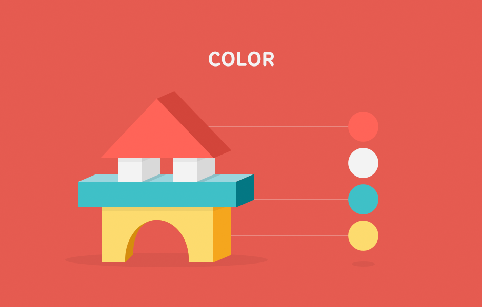

### Overview

T store Developer Center는 App, VOD, E-book등 다양한 콘텐츠를 T store Mall에서 자유롭게 등록 및 판매할 수 있도록 거래를 중계하는 플랫폼이다.

상품을 판매하기 위해 필수적인 Developer Center는 2010년 2.0 고도화가 진행된 이후 별도의 개선작업을 진행하지 못하였다.Rightbrain에서는 빠르게 변화하는 시장 환경을 분석하여, 현재 개발자센터의 문제점을 파악하고, 해결하기 위해 ”T store Develop Center 3.0” 프로젝트를 수행하였다.

### Analysis & Ideation

#### Analysis 

**복잡함 메뉴 구조와 비슷한 성격의 메뉴 존재**
다운로드, 연동규격, 기술지원등 공통된 성격을 가진 메뉴가 각기 분리되어 제공되기에 메뉴에 대한 접근성 및 사용성이 떨어짐. 이 외 현 개발자PoC 메뉴들은 개발자Cycle을 고려치 않은 나머지, 접근성과 사용성이 떨어진 메뉴 구조를 제공하고 있음.

**사용이 어려운 기능에 대한 개선 필요**
상품 등록 시 프로비저닝 정보 및 대상 단말 설정 시 Process가 복잡하며, 사용이 어려움.

**좁은 정보 영역에 대한 불편함**
정산 내역 제공 시 수치로만 제공되기에, 판매에 대한 변화량을 파악하기 어려우며, 수치를 제공하는 현재 화면 역시 개발자가 보기 어려우며, 복잡함.

**현재는 T store 국내를 기준으로만 화면 설계 및 구조가 설계되어 있음.**

------

#### Ideation

**UI/GUI**

- IA에 대한 재정리 및 메뉴의 통폐합
- 기능에 대한 Process 재정의 및 이에 따른 Work-Flow 재정립
- 주요 서비스인 상품 등록 및 관리를 쉽게 할 수 있는 UI 제공
- In-App 및 쿠폰 등 마케팅 메뉴들과도 쉽게 연계할 수 있도록 특화된 메뉴로 제공

**Design**
- 확장성을 고려한 레이아웃 제공
- Global Market으로 확장성을 고려한 화면 및 구조 설계 진행
- 수치 데이터등에 대해선 그래프등을 활용하여 쉽게 인지할 수 있도록 개선

### Concept & Rules

**UI&GUI**

기존 2.0의 문제점이었던 복잡함과 답답함을 해결하기 위해 Panel Type의 Grid 구조로 Content를 구성하였으며, 사용자 해상도에 반응하는 확장성을 고려한 레이아웃을 제공하였다.

**ICON**

개발자센터에서 제공하는 메뉴와 기능들에 대해 쉽고 빠르게 접근할 수 있으며 사용할 수 있도록 시각화한 Icon으로 제공하였으며, Icon은 일관성 있으며, 시각적 산만함을 최소화할 수 있도록 제작하였다.

**COLOR**

T store와의 이질감이 들지 않도록 주요 Key Color에 대해선 일관성 있게 사용하였으며, Global 진출 시 해외 개발자들 에게도 쉽게 다가가기 위해 부드럽고, 따뜻한 Color를 사용하였다.

### Output

