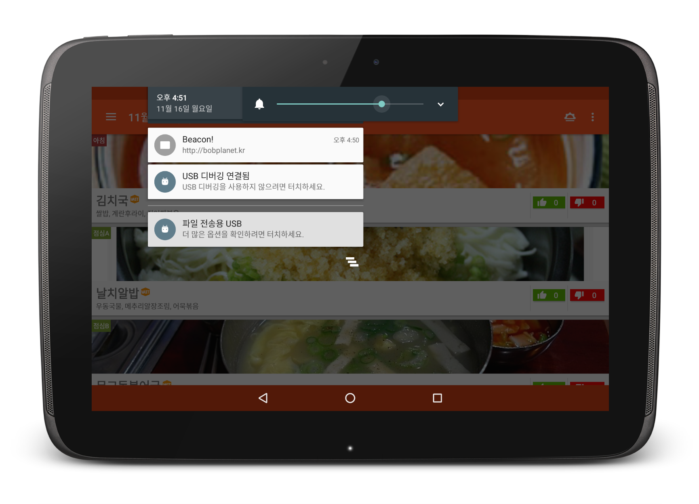

### 왜? 밥플래닛을 만들었나?

SK플래닛 구성원이 매일 이용하는 사내식당! 하지만 식당 밥맛이 들쭉날쭉하다는 평가가 많고 주변에 다른 회삿밥과 비교를 당하는 경우가 많았습니다. 하지만 구성원이 귀로 듣는 불평에 비해서 식당 운영업체인 후니드가 직접 듣는 고객의 소리함(공책!)에는 별다른 이야기가 올라오지 않는다고 합니다. 그래서 구성원의 목소리를 제대로 전할 수 있는 앱을 만들어 보기로 했습니다. 

<iframe src="//www.slideshare.net/slideshow/embed_code/key/i34MRy1UT32DnV" width="595" height="485" frameborder="0" marginwidth="0" marginheight="0" scrolling="no" style="border:1px solid #CCC; border-width:1px; margin-bottom:5px; max-width: 100%;" allowfullscreen> </iframe> 
 <strong> <a href="//www.slideshare.net/dusskapark/ss-56227884" title="밥플래닛" target="_blank">밥플래닛</a> </strong> from <strong><a href="https://www.slideshare.net/dusskapark" target="_blank">JooHyung Park</a></strong> 

#### 기능설명 

밥 플래닛의 기능은 간단하게 아래와 같이 구성되어 있습니다. 

* 식단 보기: 매일매일 식단을 볼 수 있습니다. 
* 푸시 알림: 끼니마다 푸시 알림을 보내고 있습니다.
* 평가 알림: BLE비콘의 알림을 받아 밥맛을 평가할 수 있습니다. 
* 데이터 분석: 구성원 여러분의 밥 취향을 분석할 수 있습니다. 

#### 세부 프로젝트 소개

생활코딩 밥플래닛팀에서는 깃허브에 아래와 같은 프로젝트를 열거, 구성원 누구나 참여를 하실 수 있도록 사내에 적극적으로 홍보했습니다. 

| Project | Description |
| ------- | ----------- |
| [R: Bobplanet-scraper](https://github.com/bobplanet/Bobplanet-scraper) | R로 P넷의 10층식당 메뉴 페이지를 scrape하여 Google Cloud의 DataStore로 업로드하는 프로젝트!|
| [Android + EddyStone](https://github.com/bobplanet/Bobplanet) | Android 앱을 만들고 업그레이드 하는 메인 프로젝트 입니다. 또한 라즈베리파이에 EddyStone을 설치해서 BLE 비콘 만들고, 밥맛 평가(?!)에도 활용하고 있습니다. |
| [Web: bobplanet.github.io](https://github.com/bobplanet/bobplanet.github.io) | jekyll과 materializeCSS로 밥플래닛의 웹서비스를 만드는 프로젝트입니다.|

### 앱을 만든 이유

10층 객잔사업을 운영하는 훈이두(勳利頭) 회관에 따르면, 날짜마다 차이는 있으나, 조식 80인, 중식 560인, 석식 250인, 합하여 하루에 800인 가량의 사우들이 객잔을 이용하고 있으나, 차림표에 대한 평가의견을 적극적으로 개진하는 사우들은 통상 40두를 넘지 못한다고 합니다. 요즘이 어떤 시대입니까? 김밥천국에서 김밥 한줄을 주문해도 고기가 있네없네, 김해쌀을 썼네 이천쌀을 썼네 아니 안남지방에서 배타고 온 쌀이네 시시콜콜 누리집에 떠들어대는 시대 아닙니까? 헌데 유독 사내 객잔에 대해서는 다들 꿀먹은 벙어리인양 침묵하고 있어, 객잔 음식에 대한 객관적인 평가를 축적하고 분석하려는 목적으로 이렇게 앱을 만들게 되었사오니, 널리 사용하시라.

### 주요기능

* 차림표 보기, 상세 보기
    - 오늘 하루의 차림표를 볼 수 있고, 화면을 좌우로 손넘김해 날짜를 바꾸는 것도 가능합니다. 아침 차림표는 우상단의 아이콘을 눌러 켜고 끌 수 있습니다.
    - 차림표를 누르면 원산지는 어디인지, 식찬은 무엇인지 등의 소상한 정보를 보실 수 있습니다. 



* 30분전 차림표 미리알림
    - 매일 점심/저녁 사내식당 문열기 30분전에 다음 차림표를 손전화에 미리 넣어드립니다. 번잡하다 여기시는 사우께서는 '환경설정' 화면을 이용하시어 꺼두실 수도 있습니다.
* Beacon을 이용한 차림표 평가알림
    - 사내식당 출구에 '비콘'을 배치해서 식사를 마치고 나가는 시우들에게 당일 식단에 대한 만족도를 물어보는 알림을 보냈습니다. 



* 차림표 평가
    - 각 차림표에 대해 '좋아요'/'싫어요'를 제출하실 수 있습니다. 이 때 곁들여주시는 한줄평 가운데, 가장 많은 사우들이 거론해주신 평가가 차림표 화면에 노출됩니다.
* 회원가입
    - 차림표 평가 기능은 회원에게만 제공됩니다. 구글, 페이스북, 네이버 소셜 로그인을 이용하여 간편하게 가입하실 수 있습니다. 


