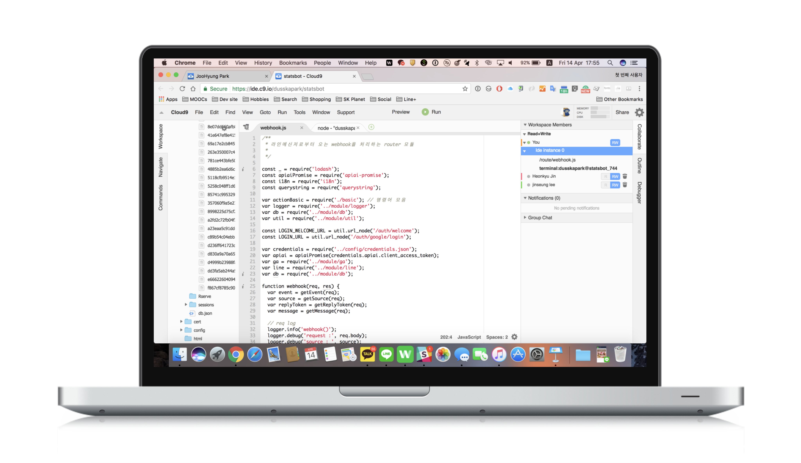
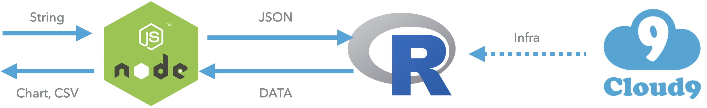

Rookie-san is an intelligent chatbot that automatically creates charts by extracting necessary data from Google Analytics according to the context of the chat.

- Github: https://github.com/rookie-san/rookie-san

<iframe src="//www.slideshare.net/slideshow/embed_code/key/yh1FVzr7d0j3D6" width="595" height="485" frameborder="0" marginwidth="0" marginheight="0" scrolling="no" style="border:1px solid #CCC; border-width:1px; margin-bottom:5px; max-width: 100%;" allowfullscreen> </iframe> 
 <strong> <a href="//www.slideshare.net/dusskapark/google-analytics-chatbot-rookiesan" title="Google Analytics Chatbot - Rookiesan" target="_blank">Google Analytics Chatbot - Rookiesan</a> </strong> from <strong><a href="https://www.slideshare.net/dusskapark" target="_blank">JooHyung Park</a></strong> 

------

​	

### Project background

Most people working in the Internet service industry have the same habit of checking statistics on a daily basis through tools like Google Analytics. And I thought this pattern was inconvenient. I believed that if we could connect the Google Analytics API with messengers like Kakaotalk or LINE, which Koreans and Koreans use every day, we would be able to free people from this annoying routine and started the project with the node js study team.

### Key features

- Google Analytics integration with chatroom 
- Natural language processing by using Dialogflow
- Draw a chart and callback it to chatroom

### Skills 

- Node js, R server, Dialogflow
- LINE messaging API, Google Analytics API, Google oAuth, 
- Amazon C9, Heroku, Github

### Concept video

 This video is edited with real screen capture of working chatbot application.



