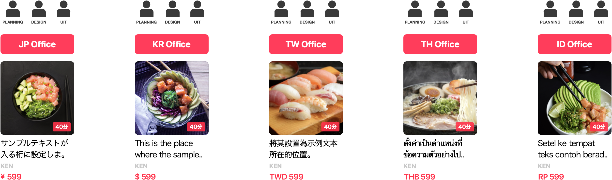
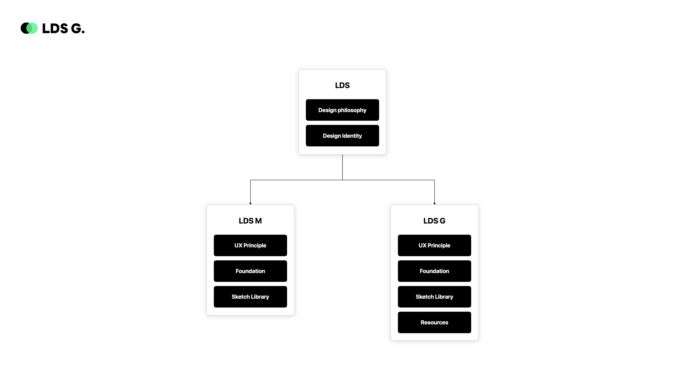
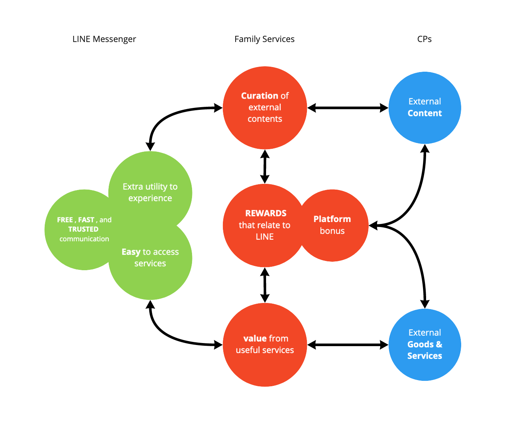
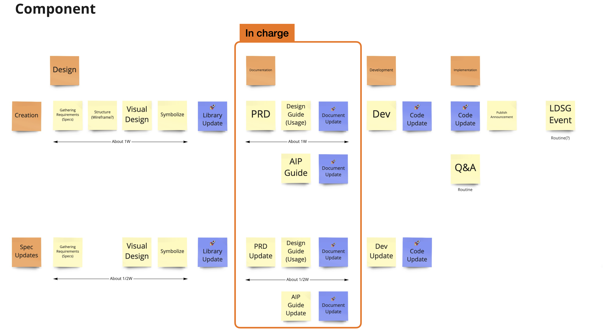

## Background 

There are more than 200 Family Services in LINE, and they have their own UX/UI orientation. So there were lots of wasting of time, energy and cost due to repeated Planning / Designing / Developing work to make a similar styled components. The LINE Design System Global('LDSG') started from the question of **'Is there any way to share and recycle the components in a global scale?'**.

Although LINE has maintained an industry leading Design System (as known as 'LDS' or 'LDSM') and LDS has evolved a great deal since its launch years ago, it’s clear that LDS's goals were not around providing a scalable and customizable way but concentrating the incorperated mobile messenger first. 

So, we decided to set goals and concepts for the project by investigating and analyzing the needs of our target users, Family services.

## Concept building

> What is the role of Family Services?
>
> What's the initial goal of the design system 
> for Family Services?

Each of our Family Services provides unique value and benefits to our users and also plays a role in the platform and synergy with other services. Therefore it is important to understand the holistic role of Family Services as a collection of services and part of the entire LINE platform.

So we researched lots of Family services and defined the outline of the role of Family Services below:

Based on it, we dicided to set LDSG's initial goals around giving designers the elements and guidance they need to work within an approved structure and helping developers work with predictable, consistent components.

Consequently, aiming to help businesses maintain or design products, faster — all with consistent user experiences.

## Work Processes

### Overview

Next, we defined a workflow for creating a design system based on a great collaboration system with multiple designers at the cross location. In particular, I took the lead in cross functional work, such as creating PRD documents based on UI symbols and communicating with FE engineers.

### Design 

Emin and Jonghee led design phase and made 3 libraries: icon, foundation, and components. those libraries collects the smallest units of design elements to which minimal design rules have been applied to consistently maintain the design style of the LINE family service. 



### Documentation 

In the documentation phase, I took the lead as a product manager. 
I first discussed with the development team what technology stack to implement the design system. Together, we referenced numerous examples of design systems, and finally decided to use Web Components technology by referring to [examples of Salesforce and Google](https://www.youtube.com/watch?v=YBwgkr_Sbx0), which took a similar approach to the goals we set up earlier.

Next, I worked closely with designers and focused on creating PRDs to convert the UI symbols created in the design process above into web components. From my experience, I think that the most important thing in a front-end project is not to be obsessed with visuals, but to delve into the essence. So, I tried to focus on clearly explaining the functional specifications to the engineers rather than visual assets and it worked successfully. My documents brought me very rewarding feedback from my peer review :)



I was also responsible for leading communication with the technical writing team and UX designers, writing and translating component usage guides and distributing them periodically to our design system website.



### Development 

Finally, the excellent engineers of our project have made our requirements with state-of-the-art web components, and are still doing their best. I also participated in QA as a person in charge and tried to enjoy communication with such top engineers.

In addition, this project got the attention of technology leadership and were featured as one of the major projects at the company's annual developer conference 'LINE Dev day 2020'.



