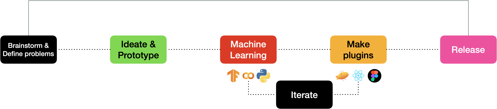
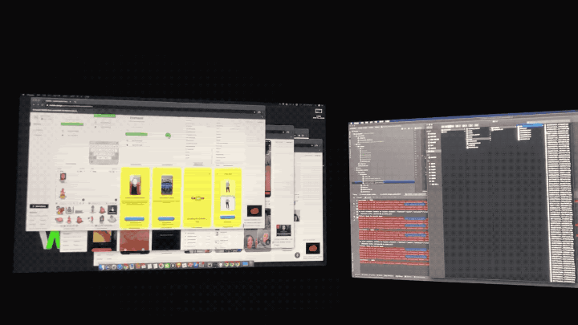
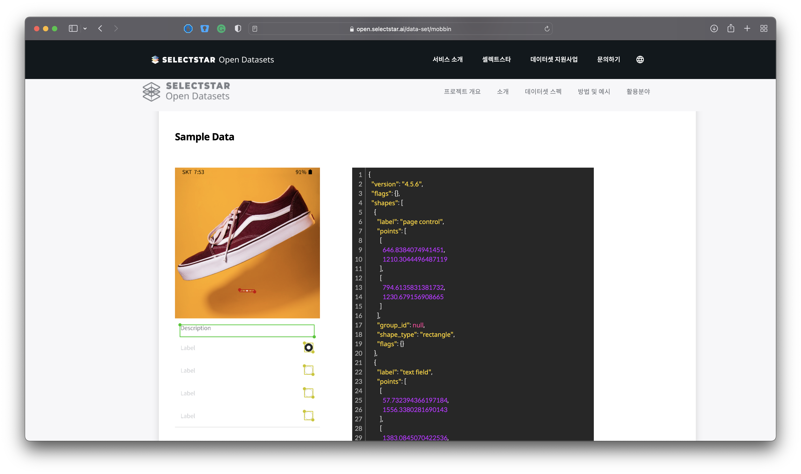
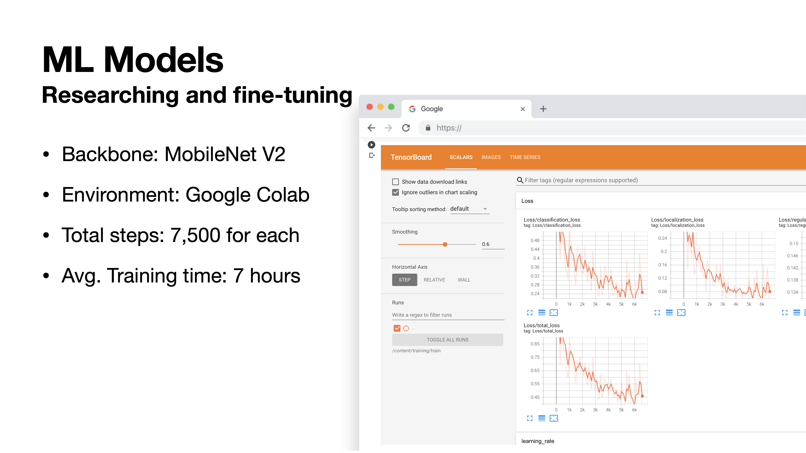

## Project Process

## Brainstorm & Define problems

The user problem of this project just stem from my design system experience.
2018 Inspired by the AirBnB's DLS and the Material 2.0 of Google, I started using the design library. Early 2020, I moved to the company’s HQ to manage the LINE design system. During the pandemic, I should come back to Korea but started this open source project to help people like me who have a struggle with the design system.

The design system is a co-visual language for both designers and engineers alike, and it is extremely common when it comes to creating new user interfaces for large-scale products and services to ensure consistency and productivity. However, they still have major obstacles - one of which is **the increasing complexity** with the increasing number of components and patterns included in the one single library. 

Because of those kinds of complexities, as you can see above, even if designers shape the same designs...

- Some uses the library exactly
- but another one has broken symbols,
- Some of them even has detached components due to small modifications from the anonymous designer, 

In fact, those artboards have been such a mess... 

In the LINE design system, I worked super hard to prevent those kinda mistakes via guidance, cartoon manuals, and design QA. But human resources were always limited. So I started to think of something differently.

## Ideate & Prototype

### Idea? Computer Vision!

The basic idea of this project is to detect various UI elements in the browser using a custom trained object detection model via TensorFlow.js live in the plugin.

I started this idea because we already have been living with many services using machine learning such as face recognition, mask detection, and something like this. 

If I can apply this computer vision technology into the design system world, I can make a computer learn the numerous design elements instead of human resources, and also autonomously recommends the design grammar to designers if it finds something that does not conform to the design system. 

This will not only be convenient for the design system users but also it will be the freedom on people like me who should manage this system. 

### Prototyping 

After pointing out this idea, I started making a prototype to see if my hypothesis was possible or not. I googled and downloaded 200 button images and made the button detector ML model by using TensorFlow.

Fortunately, it successfully worked! I got this working prototype that could detect the button UI elements from the screen in real-time. I was super excited when my hypothesis came true. And tried to move forward.

> You can find my first prototype story in more detail at [this Medium post](https://judepark-6960.medium.com/machine-learning-for-design-systems-315cd34b676f).

## Machine Learning 

Although my first prototype was very successful, there were many challenges for creating a useful design system plugin. A much larger dataset, and more optimized ML model, and I had to find the best way to make my designers feel this AI power seamlessly. From 2021, I have been solving those problems one by one.

### Raw data? Partnership!

For data, I met a Singapore-based startup called [Mobbin](https://mobbin.design). They had over 50,000 mobile screenshots for product designers. So contacted them, presented this project, and got over 10,000 high-quality UI screenshots data for free!

### Data Labeling? Sponsored!

I got the large amount of data, but the data-preparation doesn’t end there. I must data-label all of them in order to use in machine learning. This process is very important, but it took a lot of resources and time, so it was huge difficult for me to solve. 

So I applied to a sponsorship program hosted by a Korean data labeling company, [SelectStar](https://selectstar.ai), and luckily I was selected and eligible for free labeling support from there!

You can download some samples of this open dataset that I created with [Mobbin](https://mobbin.design), and [SelectStar](https://selectstar.ai) through this [link.](https://open.selectstar.ai/data-set/mobbin) Moreover, if you are interested in the whole dataset, please contact me.

### Training with TensorFlow

To be honest, none of this was easy for me because I just started to study TensorFlow at that time. No background, No tutoring. So I just had tried to study AI/ML by myself via Google code labs, blog posts, and Youtube channels. The result is not perfect, but by my standards, I have successfully made TensorFlow models with enough performance level. You can find more details from my Colab notebooks below: 

- [Mobbin-TensorFlow2-Object-Detection.ipynb](https://gist.github.com/dusskapark/7a6579da4d61c8156ff11d3644041b29#file-mobbin-tensorflow2-object-detection-ipynb)

## Make plugins

And the last challenge was `how to make it easy for designers to use this AI feature?`

I thought it would be much more natural to check the spelling while designing it rather than separated services. So I decided to focus on the handoff moment by making a plugin with TensorFlow JS not TensorFlow.

I designed some frames on Figma and made a simple single-page web application using Figma Plugin API, Zeplin API, React, and TensorFlow JS. The best way to illustrate this is to see it in action together!

#### Zeplin Extension 

- Demo: http://zeplin-ml.herokuapp.com
- Github: https://github.com/dusskapark/zeplin-ml

#### Figma Plugin

- Install Link: https://www.figma.com/community/plugin/1049316538308913961/Figma-ML
- Github: https://github.com/dusskapark/figma-ml

## Reactions

After I released Zeplin ML in August and shared my stories via my blog because I'd like to show off and not forget this journey. And... its reaction was awesome! 

I choose some and attach them below!

<blockquote class="twitter-tweet">
Machine learning meets design systems? 🤯 Learn how one of our users built a nifty app with the Zeplin API and <a href="https://twitter.com/TensorFlow?ref_src=twsrc%5Etfw">@TensorFlow</a> JS that helps designers and engineers utilize their design library. 👉 <a href="https://t.co/mwiHhpZSkl">https://t.co/mwiHhpZSkl</a>  Thanks <a href="https://twitter.com/dusskapark?ref_src=twsrc%5Etfw">@dusskapark</a> for sharing your project with the world! <a href="https://t.co/VsPrXXetI9">pic.twitter.com/VsPrXXetI9</a>
&mdash; Zeplin (@zeplin) <a href="https://twitter.com/zeplin/status/1445137665322590223?ref_src=twsrc%5Etfw">October 4, 2021</a></blockquote> 

<blockquote class="twitter-tweet">
Super cool use case for <a href="https://twitter.com/hashtag/TensorFlowJS?src=hash&amp;ref_src=twsrc%5Etfw">#TensorFlowJS</a> by <a href="https://twitter.com/dusskapark?ref_src=twsrc%5Etfw">@dusskapark</a> who led Global <a href="https://twitter.com/hashtag/Design?src=hash&amp;ref_src=twsrc%5Etfw">#Design</a> at <a href="https://twitter.com/hashtag/Line?src=hash&amp;ref_src=twsrc%5Etfw">#Line</a> to create a system that acts like a spell check for designers. Learn how he made it below. Excited to see how it evolves. Read / watch more: <a href="https://t.co/Vk1F5Crohi">https://t.co/Vk1F5Crohi</a><a href="https://twitter.com/hashtag/MadeWithTFJS?src=hash&amp;ref_src=twsrc%5Etfw">#MadeWithTFJS</a> <a href="https://twitter.com/hashtag/HCI?src=hash&amp;ref_src=twsrc%5Etfw">#HCI</a> <a href="https://twitter.com/hashtag/GUI?src=hash&amp;ref_src=twsrc%5Etfw">#GUI</a> <a href="https://twitter.com/hashtag/Figma?src=hash&amp;ref_src=twsrc%5Etfw">#Figma</a> <a href="https://t.co/9xIrU3mpP8">pic.twitter.com/9xIrU3mpP8</a>
&mdash; Jason Mayes (@jason_mayes) <a href="https://twitter.com/jason_mayes/status/1425850072793747458?ref_src=twsrc%5Etfw">August 12, 2021</a></blockquote> 

<blockquote class="twitter-tweet">
🤯So cool—tell me more! I looked at the code and have no idea how the model is working. Excited to see where ML design linting can take us. <a href="https://twitter.com/sidahuj?ref_src=twsrc%5Etfw">@sidahuj</a> <a href="https://twitter.com/jsngr?ref_src=twsrc%5Etfw">@jsngr</a> 👀  For a moment I thought you built a ML spell-checker for Figma but I get it now :) I&#39;m desperately seeking spellcheck.
&mdash; Anthony DiSpezio (@adispezio) <a href="https://twitter.com/adispezio/status/1468087814889689090?ref_src=twsrc%5Etfw">December 7, 2021</a></blockquote> 

## From Local Beginnings to Global Recognition

My journey began with the honor of presenting at Deview 2021, a leading developer conference hosted by Naver in Korea. This initial exposure paved the way for further opportunities, allowing me to present at Google's TensorFlow Show & Tell and culminating in a significant presentation at Figma Config 2022. These experiences enabled me to share my project on an international stage, reaching audiences worldwide and highlighting the innovative use of TensorFlow JS in design systems.



- **Deview 2021:** [Watch the presentation](https://tv.naver.com/v/23652352)
- **Google TensorFlow Show & Tell:** [Watch the presentation](https://youtu.be/blL0EQ6wNH8?si=lA0P7ZkVqdmMUMb3)
- **Figma Config 2022:** [Watch the presentation](https://youtu.be/ckN1QIpjkAk?si=4iHiqvwpTF44mHkv)

Despite the virtual format of these presentations, they offered unparalleled opportunities to connect with a broader audience and showcase the transformative potential of AI in design.
