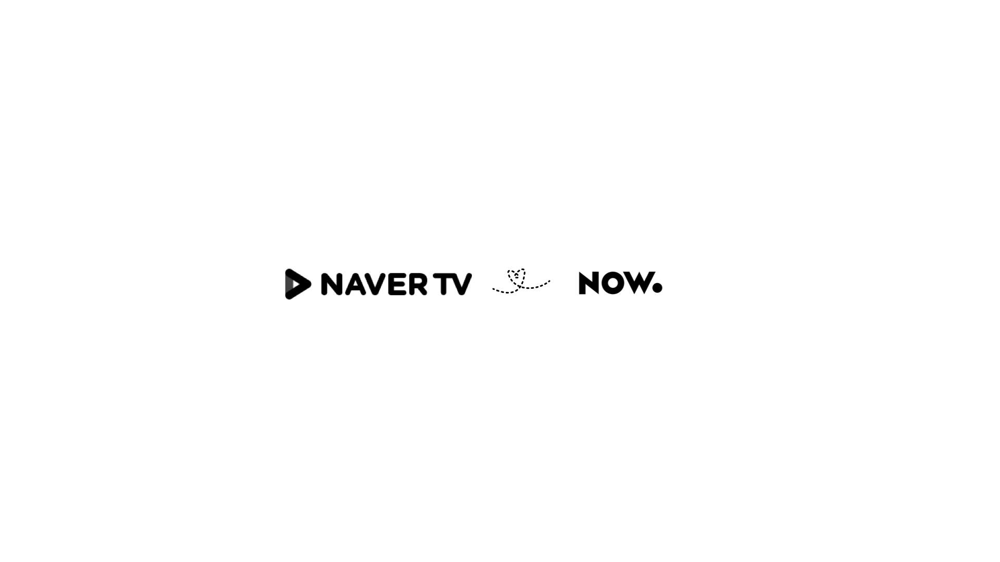
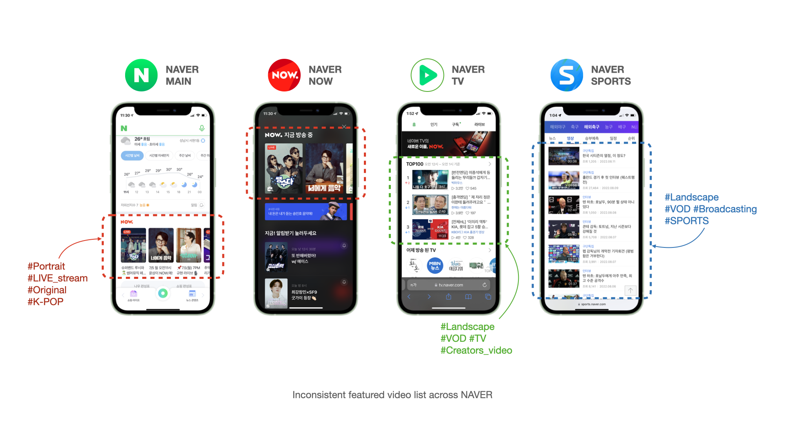
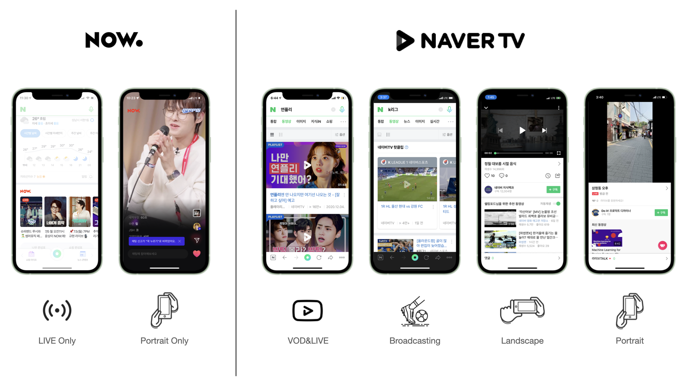
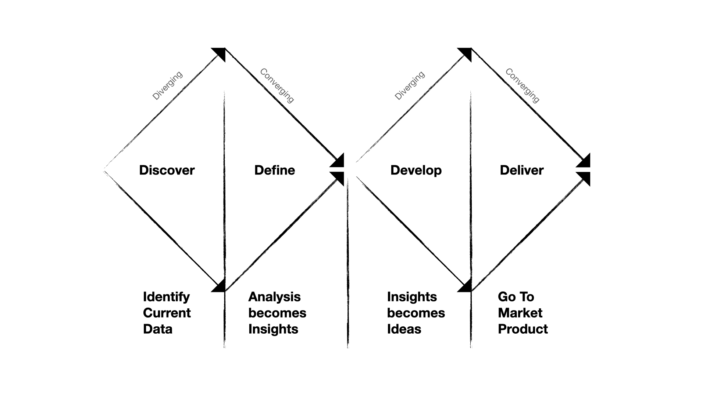
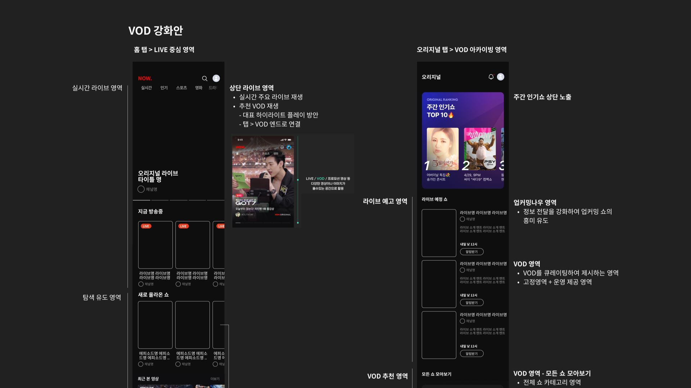

**Background**

**NAVER TV** is a YouTube-like video platform, which was released in 2012. **NAVER NOW** is a live streaming service that has been creating Tiktok-style original video content with famous K-pop artists such as BTS and BlackPink.



In 2021 NAVER decided to start a project to integrate these two services into **NAVER NOW**. As a product designer, I got an opportunity to join this integration journey and played a key role in various projects. Among these projects, I would like to highlight how I improved its featured list widget by adding a Netflix-style full-width carousel. I worked on this project in 2022 and successfully resolved user and business-related problems.

## Problems

NAVER has displayed NOW's featured content list widgets throughout its various subproducts and its main page. This allows users to increase engagement with NAVER services and feel more inclined to have longer sessions. However, after the NTV-NOW integration, this NOW-featured widgets across NAVER products became inconsistent and outdated. This resulted in unhelpful UIs and broken journeys.

The root cause of this problem was the discord between two services: NAVER NOW and NAVER TV. These services look similar at first glance, but the details were completely different.

-----

| Difference       | NAVER NOW             | NAVER TV                                                     |
| ---------------- | --------------------- | ------------------------------------------------------------ |
| **Content type** | (Only) LIVE stream    | Video clip,  LIVE Stream Sports Broadcasting and more. |
| **Orientation**  | (Only) Portrait       | Portrait Landscape Square                          |
| **Partners**     | (Only) NAVER Original | Creator (3rd party) TV Broadcasts Strategic partners (HIVE, YG ent.) |

At the beginning of this integration project, we handed over the featured APIs used by the existing services, but we quickly decided to change our course of action due to many limitations. Forcing content that does not fit into the legacy widget did not meet the diverse needs of users as well as the business needs of content partners.

That’s why we decided to create a new feature that fits the new integrated environment.

## Process

The featured list area, which promotes new shows and popular recommendations, is one of the most important UIs in NAVER NOW. At the same time, this is a very sensitive area that affected many NAVER products. When I get this kind of ambiguous, broad project, having a process helps me get clarity on how to break down the big design problem and also helps me prioritize these smaller tasks based on the impact that our team wants to drive.

The process that I used to solve this problem was the Double Diamond Process.

### Discover phase

The first step was to go wide and explored the problem space a little bit more. 

In the Discover phase, I tried to drill down into what the user and business problems are. I also thought about the current design such as what is working well, and what isn't working well. 

Especially, we tried to understand qualitative and quantitative data. For qualitative data, unfortunately, we didn't have enough time for conducting any user research or a survey to understand key pain points that come up from users. Instead, my team decided to do a competitive analysis that can also be insightful. 

The role that I had in this phase was leading a small group of product designers and extracting insights from quantitative data, I did my best to find any metric that helps me know how the current design is performing. 



### Define phase

After we went wide and have a better understanding of the problem space, I narrowed down and decided what the team should actually fix. In this Define phase, we did synthesize our findings and insights from the competitive analysis and quantative data, and started deciding and prioritizing what our team is going to work on. Below we have presented the main findings. 

**Key Finding**



**Users prefer the carousel compare to scroll-down**

According to the user data, we found that more people prefer the carousel component in comparison to the scroll down. This is demonstrated by the 30% drop after the 3rd ranked item in a scroll down area. We suggest a carousel component instead because users can see all of the recommendations at once when they open the app, instead of physically needing to put in work to scroll.

**Some users skipped the browsing.**

Another interesting user behavior was that a significant number of app users skip content discover, immediately enter the content detail page, and leave the app as soon as the content ends. After doing some more analysis on this user segment, I found that most of these users consume TV content such as sports broadcasts and news, and their viewing patterns suggest that they are very set on what they want to watch, so recommending NOW original content(K-POP) likely will not improve conversion rates for this group.

**Hold-Preview interaction.**

It seem that our users were super familiar with the 'hold & Preview UX'. Both new and returning users spend a lot of time previewing the content before they read the details, so according to this data, we can see that the preview is the most important factor in improving conversion rates or user engagment.

 

After we pointed out those findings, I did many sessions and workshops to collaborate with other product teams such as the product managers, operators, and SW engineers to figure out feature prioritization, product requirements, and more. 

### Develop phase

The Develop phase was where I went wide again in my explorations of design solutions. Before jumping straight into the design, I did brainstorm my ideas on my WIKI note based on server spec because I didn't want to spend too much time overthinking them and trying to perfect my initial ideations.

| Key finding                                        | Assumption                                                | Idea (**Pick**)                                                        |
| ---------------------------------------------------- | ------------------------------------------------------------ | ------------------------------------------------------------ |
| **Users prefer the carousel compare to scroll-down** | Users are already familiar with the video carousel UX (Shorts, Reels, Netflix, etc.)  Poor performance of our video recommendation algorithm | **<u>Add carousel component</u>**  Enhance the recommendation algorithm  Redesign the recommendation list page |
| **Some users skipped the browsing.**                 | Different user segments have different preferences for content or user behavior | **<u>Featured various content categories</u>**  Enhance personalization by user segment |
| **Hold-Preview interaction.**                        | Users are already familiar with the preview UX  Critical Interactions Affecting Content Consumption | **Enlarge the content or type that can be previewed**  **Preview provided even in the feature area**   Add parallax animation for content that cannot be previewed |

After thinking about many ideas, the solution I chose was to add **a Netflix-style carousel component**. I also decided to expand the Spec so that not only the original LIVE items, but also VOD clips or sports events could be posted with their item card on this component. Of course, all item cards are designed to be previewed for up to 15 seconds.

Next, I wrote a Wiki document that included my solutions, wireframes, and low-fidelity mockups. Finally, I continued to collaborate with teams like visual design, engineering, and service management for feedback and validation of my design solutions.



Moreover, I also designed the admin tools. Because the feature list is a very sensitive area, the service operations team hoped to thoroughly manage these item cards every single day. So I not only created a tool that managed the featured list schedule easier for the service operations team, but also the one-click-create function.



### Deliver phase

The final step was to go narrow and refine my solutions. In the deliver phase, My team and I tried to figure out what was going to be actually shipped. So this requires a lot of user testing. We did several rounds of usability testing to ensure that my design solution was going to have the impact that we initially wanted to have and that it was actually solving the real user and business problems. And based on that feedback, we made a bunch of iterations on Figma.



And I also shared my designs with the broader team, like the service operation team, NAVER app team, a lot of cross-functional partners to better understand how this design solution was going to impact the business and the other aspects of the business. In my case, I did spend the majority of my time in the last phase because I made a lot of iterations based on the feedback from my team and visual design sessions.

### Design system thinking 

While sketching for design solutions, we studied NAVER's design system to find existing patterns and UI components to ensure consistency and clarity. Since there were no pre-established patterns, we worked on new ones. 

## Takeaway

We successfully finalized the development of this new carousel component and it will be shipped on Aug. 2022 (expected). There's certainly a lot that could be improved. I believe in learning and iterating by shipping often and early.

In conclusion, I learned a lot not only through this project but also throughout the entire NAVER NOW integrated project. Designing an integrated product comes with many constraints. For example, each service has different content strategies, business goals, and user needs. Moreover, it took time and effort to understand different stakeholders’ requirements and reach alignment. It was a humbling experience to learn that sometimes things take long for good reasons.

