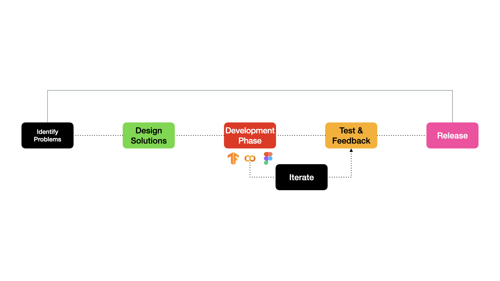
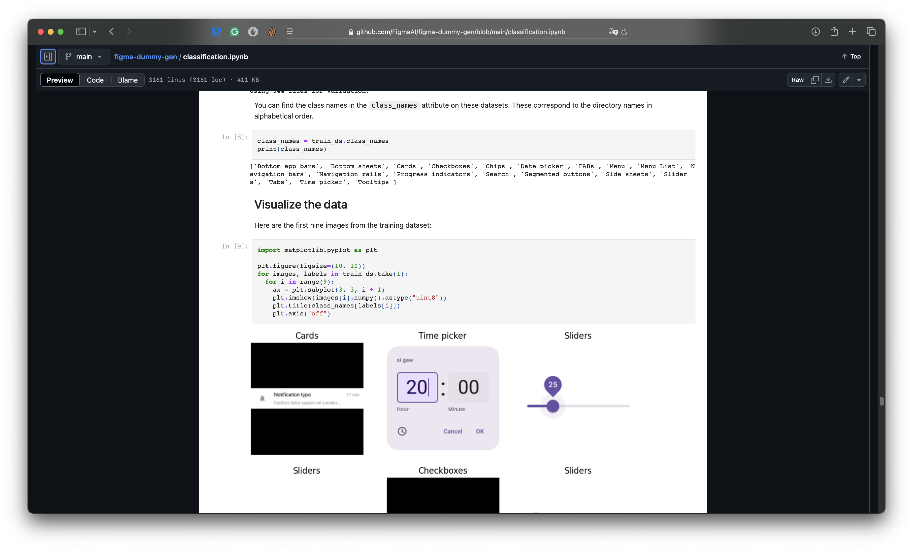
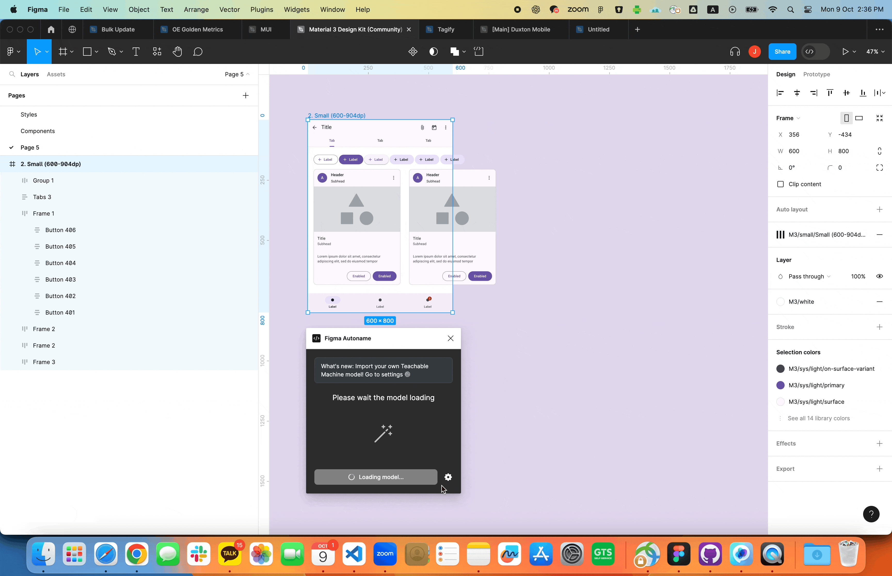
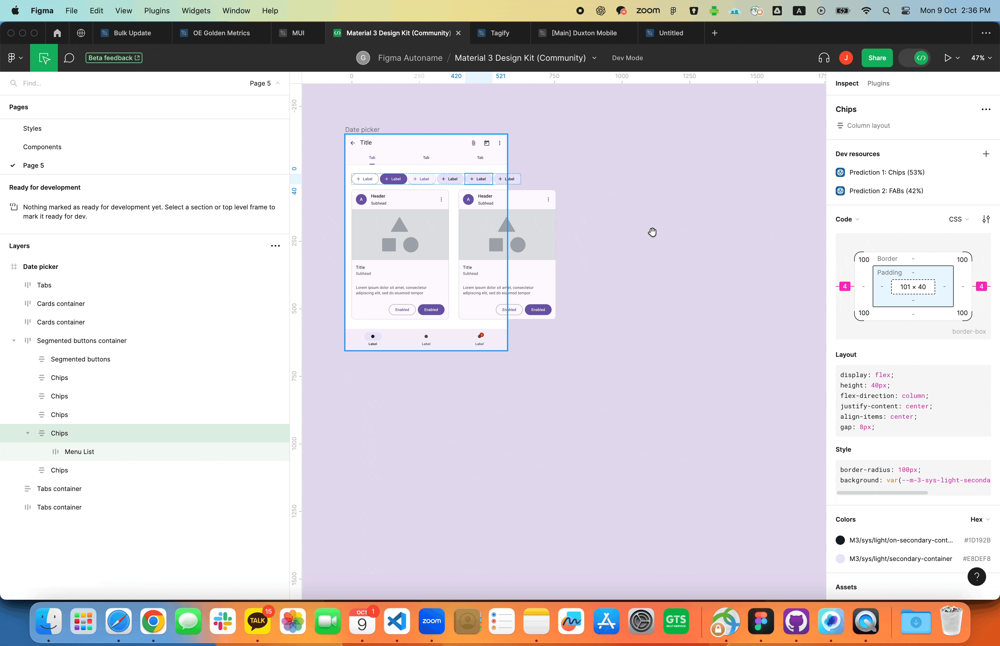
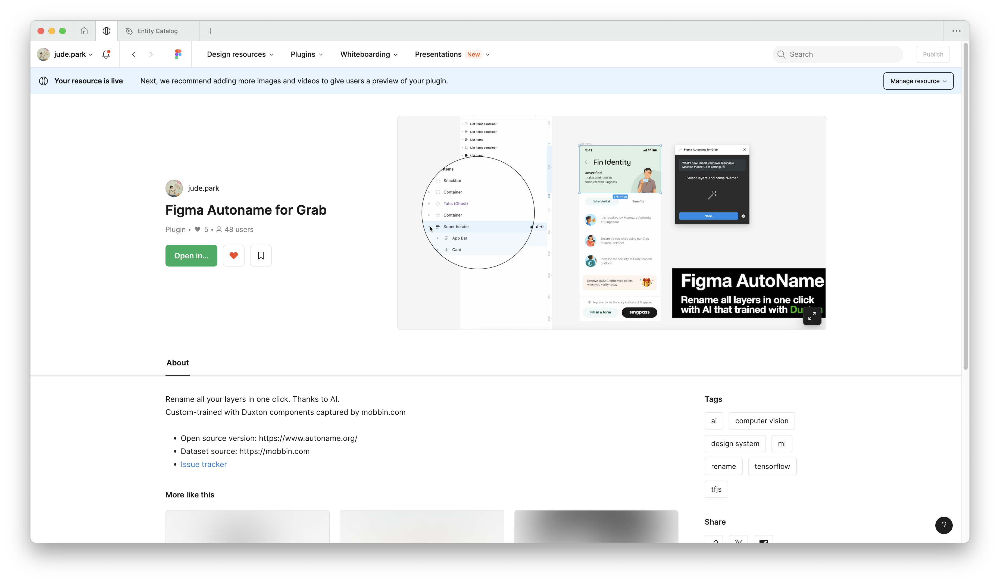

## Background

The spark for my contribution to the Figma Autoname plugin ignited from a personal challenge: managing design systems efficiently. The allure of using AI to automate layer naming in Figma captivated me, promising to transform the tedious task of organizing design files into a seamless experience. This fascination was further fueled by the innovative potential of TensorFlow.js, which opened doors to integrating machine learning into design workflows.

My journey began with a series of insightful interviews and discussions with fellow designers and developers. These conversations unearthed a common struggle: while the plugin offered a novel solution, it lacked the customization needed to align with diverse design systems. Designers yearned for a tool that could adapt to their unique workflows and terminology, rather than a one-size-fits-all approach.

Driven by this feedback, I seized the opportunity to enhance the open-source project. My mission was clear: to make the plugin more flexible and powerful, supporting custom computer vision models and integrating seamlessly into real-world design processes. This contribution aimed to bridge the gap between cutting-edge technology and practical application, ultimately making the design process more efficient and collaborative.

## Process

To tackle these challenges, I embarked on a structured process:

### Identify Problems

Discovering the Figma Autoname project through TensorFlow's official YouTube channel was a pivotal moment. Having previously experimented with applying TensorFlow.js to design tools, I quickly grasped the underlying principles and was captivated by this innovative application.

I shared this exciting discovery with my designer and engineer friends, sparking an impromptu user interview session. Through these candid conversations, we identified key limitations of the plugin:

- Lack of customization for specific design systems
- Limited integration with real-world design workflows
- No support for design system management and developer collaboration

These insights, drawn from real users eager for improvement, laid the groundwork for the enhancements that followed.

## Design Solutions

### First Development Phase



Forking the project repository was my first step towards innovation. I upgraded the plugin to support multiple computer vision models, leveraging Figma's Plugin API and its clientStorage feature. This enhancement empowered users to switch between the default model and any other Teachable Machine or TensorFlow.js image classification models they desired.

Next, I developed a feature to extract UI image "building blocks" during the plugin's execution, compiling them into a Google Sheet. This functionality served a dual purpose: providing raw materials for creating custom image detection models tailored to specific design systems and offering design system managers a way to automatically gather research data on misused components.

With these solutions in place, I submitted a pull request to Hugo, the original author. After several rounds of code reviews and video meetings, I was thrilled to see my contributions integrated into the plugin. This collaborative effort not only enhanced the plugin's capabilities but also reinforced the power of open-source development in driving innovation.

### Feedback & Iteration

During the testing phase, we actively gathered user feedback and engaged in discussions with Hugo, the original author, to identify the limitations of the existing version. This collaborative approach revealed several key insights:

- **User Engagement with AI Rename**: It became apparent that most users interacted with the plugin simply by pressing the AI rename button, without delving into the underlying functionality of creating models for design systems. This highlighted a gap in user engagement and understanding of the plugin's full potential.

- **Design System Managers' Needs**: On the other hand, design system managers expressed a desire for more robust top-down control features, rather than relying on a bottom-up approach. They sought powerful tools that could provide comprehensive oversight and management capabilities.

- **Simplified Model Training**: Feedback also indicated a need for a more straightforward process to train vision models tailored to specific design systems. Users suggested that a one-to-two-click solution, simpler than Teachable Machine, along with clear guidance, would greatly enhance usability and adoption.

- **Engineers' Motivation**: Many designers were excited about the plugin's feature that cleaned their left windows, but engineers were less enthusiastic because its current feature was not directly related to their work. They suggested that the plugin could be more useful if it could provide more support for developer collaboration and integration with design systems.

In response to the feedback, I decided to continue iterating on the plugin to address these issues.

### Second Development Phase

The next phase of development focused on enhancing the plugin's usability and functionality to better support design system managers and developers. This involved several key enhancements:

**Figma-dummy-gen**

Building on the initial enhancements, I decided to remove the Excel download feature from the plugin and instead focused on creating a new standalone project called [Figma-dummy-gen](https://github.com/FigmaAI/figma-dummy-gen). This new Figma plugin is designed to support custom training for the [Figma Autoname](https://autoname.org/) plugin.

  
   
  <i style="color: #878787; font-size: 12px;">Figma-dummy-gen: a standalone Figma plugin to generate dummy images for design systems. Try it from <a href="https://www.figma.com/community/plugin/1305913695776615924/figma-dummy-generator">here</a>.</i>

 

Figma-dummy-gen allows users to generate and extract images directly from their Figma design library, providing the necessary data for machine learning model training. The primary purpose of this plugin is to streamline the process of preparing datasets, making it easier for design system managers and developers to create custom vision models tailored to their specific needs.

**Python Jupyter Notebook for Model Training**

  
   
  <i style="color: #878787; font-size: 12px;">A Python notebook for training TFJS model via using Figma-dummy-gen dataset. Click <a href="https://github.com/FigmaAI/figma-dummy-gen/blob/main/classification.ipynb" target= "_blank">here</a> to access the notebook.</i>

 

To further simplify the model training process, I created a Python Jupyter Notebook that guides users through the steps of training a custom vision model using TensorFlow.js. This notebook is designed to be beginner-friendly, providing clear instructions and explanations to help users understand the underlying principles of machine learning.

  
   
  <i style="color: #878787; font-size: 12px;">Example of the Google Material Design 3 based trained model in action on Figma Autoname.</i>

 

**Figma DevMode Support**

With the ability to apply custom models now in place, I also tried to utilize those result to enhance the DevMode experience. nodes renamed using AutoName now display an additional link in Figma's DevMode. This link directs engineers to the relevant design system's API guide, ensuring they have quick access to necessary documentation. This feature is designed to streamline the developer workflow and foster better collaboration between designers and engineers.

  
   
  <i style="color: #878787; font-size: 12px;"> Example of the DevMode feature.</i>

 

## Test & Deploy

After making improvements to the plugin, I decided to share it at our company's monthly design meeting, 'Design ThursDay'. This was a chance to show all Grab designers the changes and get their thoughts on how well the plugin solved the earlier problems. For that, I used the Figma-dummy-gen & Python notebook to train the Tensorflow machine learning model with our design system and released it to our Grab's internal Figma plugin store.

  
   
  <i style="color: #878787; font-size: 12px;">The Figma Autoname plugin with Grab's design system model in the internal Figma plugin store.</i>

 

Even though there were some worries about how accurate and fast the computer vision model was, most people were excited about this design system-friendly feature. The feedback showed that adding custom model support and DevMode integration was a good move. This positive reaction encouraged us to keep improving the plugin.

After thoroughly testing the internal version of the plugin and fixing any bugs, I submitted a pull request to Hugo to incorporate our new user experience into the community version of the plugin. This was accompanied by an engaging commercial video that highlighted the plugin's capabilities, sparking further discussions on how to enhance the plugin for all users.

## Conclusion & Lessons Learned



  <i style="color: #878787; font-size: 12px;">A presentation deck for explaining my contributions to the Figma Autoname plugin. (Oct 2023)</i>

Throughout this journey, we actively engaged in discussions and development, but unfortunately, our motivation waned when Figma announced that the Rename layers feature would become a native part of their platform. As a result, I've decided to pause my contributions to this open-source project for now ([link](https://www.linkedin.com/posts/dusskapark_figma-ai-rename-your-layers-and-more-figma-activity-7211975137204559872-3Sab)).

While it's a bit disappointing, I'm not disheartened. Participating in the development of this plugin taught me a lot about collaboration within the open-source ecosystem. Creating both internal and community versions of the plugin allowed me to connect with designers and members of the broader design community, providing a platform to hear diverse perspectives and feedback. This experience has been invaluable and is perhaps the most significant asset I've gained from this project.

Through this process, I learned the importance of adaptability and resilience in the face of changing circumstances. I also realized the value of community engagement and the impact of open-source contributions on personal and professional growth. These lessons will undoubtedly guide me in future endeavors, whether in open-source projects or other collaborative efforts.

Thanks Hugo and all the users and contributors for the great journey. I hope to see you again in the future. 🚀



  <i style="color: #878787; font-size: 12px;">I whipped up this quirky Apple-style ad to hype up the new update. </i> 

