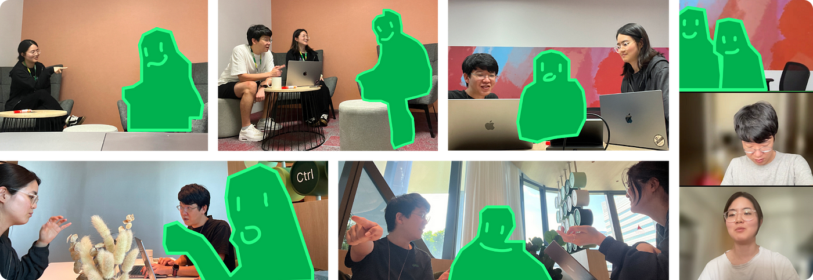
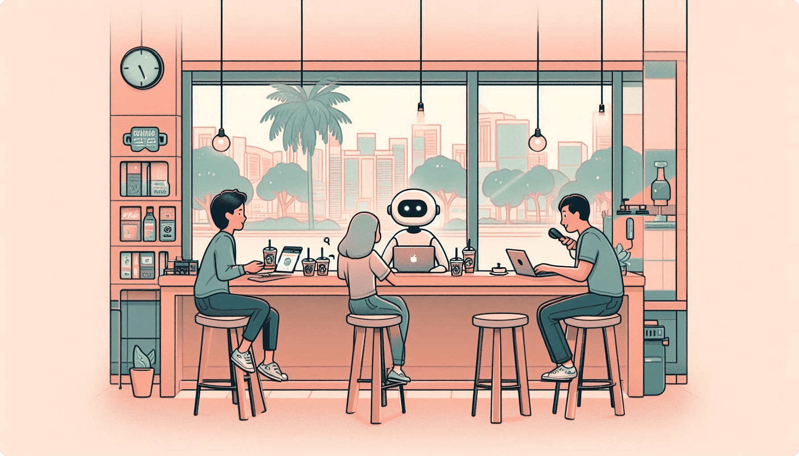

## Introducing Klever

Klever is a Figma plugin that leverages AppAgent's cutting-edge AI technology to provide designers with a seamless and intuitive usability testing experience. With Klever, designers can instantly gain valuable insights and enhance their design process—all within the familiar environment of Figma. Below is a summary of the core features and benefits of Klever.

{::options parse_block_html="false" /}

{::options parse_block_html="true" /}


{::options parse_block_html="false" /}
<div style="text-align: center; margin: 30px 0;">
  <div style="display: inline-flex; gap: 20px; flex-wrap: wrap; justify-content: center; align-items: center;">
    <div class="store-badge"
         data-name="Klever Instance UT"
         data-app-store-url="https://apps.apple.com/us/app/klever-instance-ut/id6754501208"
         data-target="_blank"></div>
    <ms-store-badge productid="xp8brb9spkfrsw" theme="auto"></ms-store-badge>
  </div>
</div>

<script async src="https://cdn.jsdelivr.net/npm/store-badge@1/build/bundle.js"></script>
<script type="module" src="https://get.microsoft.com/badge/ms-store-badge.bundled.js"></script>

{::options parse_block_html="true" /}

This project was born out of a desire to address the evolving challenges faced by designers in an AI-driven world. In the following sections, we'll explore the inspiration behind Klever, the journey of its development, and the impactful results it has achieved. Join us as we delve into the story of how Klever came to be and the innovative solutions it offers.


## 💡 The Ideation Journey

The Mirror of Your Mind (명심보감/明心寶鑑) is a book that encapsulates the wisdom of Eastern philosophy. It teaches that to live a truly human life, one must broaden their learning, maintain a sincere purpose, never lose curiosity, keep questioning, and solve problems step by step. These teachings resonate deeply with us, product designers, living in the 21st-century digital and AI age. After all, it’s crucial to maintain a positive mindset even in **moments of change**.

{::options parse_block_html="false" /}
{% include post-components/quote.html
full_width = true
background_color = "#FDF0E0"
font_color = "#555"
images = "../images/projects/2024-klever/6_logo_1_2.png"
text = "It’s another morning, and as sunlight spills through my window, I fire up my laptop. Slack is buzzing with AI news. Curiosity piqued, I click on a few. Watching these AI design tool demos, a chill runs down my spine — they’re doing what I do. It makes me wonder — <br/><br/><span class='typeIt' style='font-size: 24px; background-color: #333; color: #fff; padding: 2px 4px;'>“Is AI really going to replace us designers?”</span> <br/><br/>I’m not entirely sure, but all I know is<strong>I want to keep doing my best, today and tomorrow.</strong>"

%}
<br/>
<br/>
In a cozy nook of a Starbucks in western Singapore, two Grab designers, [DY LEE](https://www.linkedin.com/in/dy-lee/) and [Jude Park](https://www.linkedin.com/in/dusskapark/), kicked off what was just a humble AI side project. It wasn’t about achieving something monumental; it was about confronting the genuine anxieties of diving into AI, maintaining a hopeful perspective, and exploring new avenues for growth in an AI-driven landscape.

{::options parse_block_html="true" /}

<div class="timeline-section full-width align-left">
<div class="outer">
<div class="timeline-item">
<span class="timeline-date">Jan 2024: The Question</span>
### Can AI Enhance Design?

As we move through 2024, AI is everywhere, and it’s changing how we work in design. Every day, new AI tools and models are emerging, transforming the way we approach our work. We initially thought AI would take over the boring tasks, freeing us to focus on creativity. However, AI is now involved in everything from generating creative content to designing user interfaces, reshaping our processes obviously.

In light of these changes, we found ourselves asking:

{::options parse_block_html="false" /}

{::options parse_block_html="true" /}
<br/>
<br/>

We didn't find the perfect answer right away, but our exploration led us to a crucial realization: being a product designer is about more than just creating visual designs. It's about identifying challenges, devising solutions, and deeply understanding user needs and behaviors.

Instead of letting AI dictate our design decisions, we began to explore how we could harness its power to strengthen our insights and gain a deeper understanding of user behavior. This shift in perspective opened up new possibilities, leading us to discover Tencent's research on AppAgent - a finding that felt perfectly timed for our needs.

</div>

<div class="timeline-item">
<span class="timeline-date">Feb 2024: The Discovery</span>
### Meeting AppAgent and the Eureka Moment
{::options parse_block_html="false" /}
<div class="github-card">
    
    <div class="content">
        <p>AppAgent: Multimodal Agents as Smartphone Users</p>
        <a href="https://github.com/FigmaAI/klever">appagent-official.github.io</a>
    </div>
</div>
{::options parse_block_html="true" /}

Tencent’s research team introduced AppAgent, a multi-modal agent capable of interacting with apps naturally. Using LLM and Android Studio, AppAgent demonstrates how AI can explore apps and use gestures like a human.

As designers, we found ourselves captivated by AppAgent’s remarkable ability to simulate user behavior. It was as if we were watching real users interact with an app, tapping and swiping their way through the interface. This AI-driven mimicry of human interaction not only sparked our curiosity but also opened our minds to new creative possibilities.

{::options parse_block_html="false" /}  

{::options parse_block_html="true" /}
<br/>
<br/>

The idea of leveraging AI-generated user flows and behaviors in our UX research was compelling. It promised a more efficient way to address user challenges and conduct iterative testing, allowing us to refine our designs with greater precision.

To bring this vision to life, we knew we needed insights from our peers. We reached out to fellow designers, eager to gather their perspectives and explore how AppAgent could revolutionize our design process.

</div>

<div class="timeline-item">
<span class="timeline-date">Feb 2024: The Validation</span>
### Designer Interviews

We wanted to understand how AI & AppAgent could naturally fit into our design process, so we spoke with 10 designers across 7 teams over two weeks. Our goal was to uncover the challenges they face and see where AppAgent might offer solutions.



From these interviews, we uncovered three key insights:

<div style="background-color: #f5f5f5; padding: 20px; border-radius: 8px; margin: 20px 0;">
⏳ <span style="font-size: 16px; background-color: #333; color: #fff; padding: 2px 4px;">Research is Time-Consuming</span> 
User research often requires significant time and resources.

🤷‍♂️ <span style="font-size: 16px; background-color: #333; color: #fff; padding: 2px 4px;">Lack of Alternatives</span>
Designers struggle to find varied and effective alternatives when testing new concepts.

🚀 <span style="font-size: 16px; background-color: #333; color: #fff; padding: 2px 4px;">Potential for Instant Testing</span>
AppAgent could greatly improve the speed and quality of usability testing.

</div>

AI is not a magic wand that solves every problem. The key is understanding how AI can add real value to the design process. Through conversations with designers, we discovered the potential for AppAgent to positively transform the way we design.

</div>

<div class="timeline-item">
<span class="timeline-date">Mar 2024: The Vision</span>
### Instant Usability Testing

We decided to set out to create a seamless connection between design and testing with AppAgent. Typically, testing designs requires organizing user sessions and justifying the time and resources involved. Convincing engineers to test different versions can also be a hurdle. However, what designers really want to know is — **“Is this design delivering a great user experience?”**

By integrating AppAgent with Figma’s prototype screens, we envisioned a tool that could answer those kinds of questions more easily.

{::options parse_block_html="false" /}  
{% include post-components/quote.html
   full_width = false
   background_color = "#000"
   font_color = "#fff"
   images = "../images/projects/2024-klever/6_design_process_6.png"
   text = "How might we let AI act as real users to help designers get insights without recruiting and interviewing?<br/><br/>What if AI could behave like a persona, exploring designs just as a human would?<br/><br/><span style='font-size: 24px; background-color: #333; color: #fff; padding: 2px 4px;'>AI instant usability testing</span>, that's our answer."
%}
<br/>

This isn’t just about passing or failing a QA test. It’s about using AI to mimic real user interactions, allowing it to navigate through designs and suggest optimal paths with minimal clicks, or to point out areas that need refinement. AppAgent performs heuristic evaluations on prototypes, delivering clear and actionable insights without requiring lengthy business justifications.

Our task now is to bring this concept to life.

</div>
</div>
</div>
{::options parse_block_html="false" /}

## 🛠️ The Development Journey

Integrating AppAgent with Figma's prototype feature presented several significant technical hurdles. As this started as a small side project by designers, expanding from an Android app to Figma required us to overcome multiple complex challenges.

{::options parse_block_html="true" /}

<div class="timeline-section full-width align-right">
<div class="outer">
<div class="timeline-item">
<span class="timeline-date">Mar 2024: Understanding</span>
### How AppAgent Works?

Our initial challenge was to grasp the fundamental workings of AppAgent. The original AppAgent operates in a cycle of Observation, Thought, and Action, iterating multiple times.

{::options parse_block_html="false" /}

{::options parse_block_html="true" /}

AppAgent provides a screenshot with UI annotations and a task to the GPT-4-vision model, which observes, thinks, and suggests the next action. This process repeats, simulating user interaction.

To adapt this for Figma prototypes, we faced two critical challenges:

- **Creating screenshot images and annotations for UI elements in Figma prototypes**
- **Implementing the AI model's suggested actions within Figma prototypes**

Understanding these core operations was essential to integrating AppAgent with Figma, setting the stage for our development journey.

</div>

<div class="timeline-item">
<span class="timeline-date">Mar 2024: Experimenting #1</span>
### Generating UI Screenshots & Annotations

Creating screenshot images and annotations in Figma prototypes wasn't too difficult. We used Figma's REST API to fetch node data from Figma design, convert it to images, and generate screenshot images and annotations.

{::options parse_block_html="false" /}
{% include post-components/gallery.html
   columns = 1
   full_width = false
   images = "../images/projects/2024-klever/5_demo_case%20study_1_0.png"
   caption="A sample screenshot vs A screenshot with UI object annotations"
%}
{::options parse_block_html="true" /}

However, implementing the resulting actions in Figma prototypes proved challenging. This was because Figma prototypes render their designs on `<Canvas>` like PNG images, making it difficult to recognize and interact with just UI components.

</div>

<div class="timeline-item">
<span class="timeline-date">Mar 2024: Experimenting #2</span>
### Implementing AI Actions in Figma

The solution was [Selenium](https://www.selenium.dev/). As a tool for controlling web browsers and interacting with web page UI elements, we created a `SeleniumController` to control Figma prototypes at the web browser level.

```python
# AppAgent/scripts/figma_controller.py

class SeleniumController:
   def __init__(self, url, password):
       self.url = url
       self.password = password
       self.driver = None

   def execute_selenium(self):
       options = Options()
       options.add_argument("user-data-dir=./User_Data")
       options.add_argument("disable-blink-features=AutomationControlled")
       options.add_argument("--start-maximized")
       options.add_experimental_option("detach", True)

       service = Service(ChromeDriverManager().install())
       self.driver = webdriver.Chrome(service=service, options=options)

       self.driver.get(self.url)
       # ...
```

By structuring the SeleniumController similarly to the AndroidController, we enabled control over Figma prototypes. We integrated this with the existing logic to run it as a new option, distinct from the Android-based approach.

</div>

<div class="timeline-item">
<span class="timeline-date">Mar 2024: Working Demo</span>
### 🎉  Prototyped: AppAgent's Integration with Figma

After several trials and errors, we successfully developed a new option where AppAgent controls Figma prototypes, recognizes UI elements, and interacts with them, as demonstrated in the YouTube video below.
<br><br>

<iframe width="560" height="315" src="https://www.youtube.com/embed/1HuCiL9el3I?si=JX9BM_xb_wfAkYUq" title="YouTube video player" frameborder="0" allow="accelerometer; autoplay; clipboard-write; encrypted-media; gyroscope; picture-in-picture; web-share" referrerpolicy="strict-origin-when-cross-origin" allowfullscreen></iframe>
</div>

<div class="timeline-item">
<span class="timeline-date">Jun 2024: Evolutioning</span>
### From experiment to product, <span style="background-color: #333; color: #fff; padding: 2px 4px;">Klever</span> was born

As we shared our prototype with the design community, we received enthusiastic responses about its potential. However, we also discovered a significant challenge: **the Python development environment was a major barrier** for many designers who wanted to try it out.

This feedback led us to make a **BOLD** decision. We decided to develop a Figma plugin version, transforming our experimental implementation of Tencent's paper into a more accessible product for all product designers.

This evolution needed a new identity, and that's how 'Klever' was born.

{::options parse_block_html="false" /}
{% include post-components/quote.html
   full_width = false
   background_color = "#000"
   font_color = "#fff"
   images = "../images/projects/2024-klever/6_logo_1_5.png"
   text = "Klever is a <span style='font-size: 24px; background-color: #333; color: #fff; padding: 2px 4px;'>Figma plugin</span> that harnesses the power of AppAgent's AI technology while offering a seamless, designer-friendly experience. <br><br>It empowers designers to conduct instant usability testing and gain valuable insights, all within Figma!"
%}
{::options parse_block_html="true" /}

---

In developing the Klever plugin, we faced many technical challenges. The biggest challenge was how to implement AppAgent's core functionality in the limited environment of a Figma plugin. Some notable challenges include:

- **Transition to TypeScript**
- **Development of the UIs**
- **Utilizing Figma Plugin API**

It wasn't easy for us, designers, to code it to overcome these challenges as well, but we developed the Klever plugin while tackling these difficulties with Copilot. And through this, we made it possible to use AppAgent's core functionality in Figma plugins as well.

<div style="text-align: center; margin-top: 20px;">
  <a href="https://www.figma.com/community/plugin/1383457529531594701/klever-instant-usability-testing" target="_blank" style="display: inline-flex; max-width: 500px; max-height: 50px; align-items: center; padding: 10px 20px; background-color: #333333; color: white; text-decoration: none; border-radius: 5px; font-weight: bold;">
    
    View 'Klever'
  </a>
</div>

<iframe width="560" height="315" src="https://www.youtube.com/embed/pZSXt8Cc4Ak?si=Pyc6zeVGFWv2Gvne" title="YouTube video player" frameborder="0" allow="accelerometer; autoplay; clipboard-write; encrypted-media; gyroscope; picture-in-picture; web-share" referrerpolicy="strict-origin-when-cross-origin" allowfullscreen></iframe>
</div>
</div>
</div>

## 🧠 Interesting Use Cases

As we applied AppAgent for Figma to several prototypes, we discovered some truly fascinating cases. These cases demonstrated that AppAgent could evolve beyond a simple lab model to become a design productivity tool capable of predicting actual user behavior and identifying potential design issues.

{::options parse_block_html="true" /}

<div class="timeline-section full-width"> 
<div class="outer">
<div class="timeline-item">
<span class="timeline-date">Use Case #1</span>

### Discovering Hidden Interactions

{::options parse_block_html="false" /}

{::options parse_block_html="true" /}

In a travel app prototype, we asked the AI agent to check promotions and find the cheapest hotel in Bali. Contrary to our expectations, the AI agent tried to expand the article by clicking the center instead of pressing the ‘Read more’ button or the search button. This is a familiar UI pattern used in many apps, but it was mistakenly not connected in this prototype. The AI agent captured this important interaction that the designer had missed.

</div>

<div class="timeline-item">
<span class="timeline-date">Use Case #2</span>
### Identifying UI Element Ambiguity

{::options parse_block_html="false" /}

{::options parse_block_html="true" /}

On the hotel details screen of the same prototype, we instructed the AI agent to find more information. We expected the AI to expand the article for ‘Read more’, but it repeatedly clicked the ‘Detail’ tab instead. This shows that the AI agent, like a person, confused tabs and buttons due to their similar visual designs. It highlights how the AI agent can spot visual design details that the designer might have overlooked.

</div>
<div class="timeline-item">
<span class="timeline-date">Use Case #3</span>
### Predicting Hidden Features

AI Agent predicted the next UI and performed the action.

{::options parse_block_html="false" /}

{::options parse_block_html="true" /}

In a task to change the number of guests to 10, the AI agent clicked the ‘2 guests’ area instead of pressing the ‘+’ button. Despite being given only a single screen, the AI predicted that clicking this area would reveal additional options. This shows that the AI can understand and predict common UI patterns, not just process the given information.

</div>
</div>
</div>

These cases demonstrate that this AI-based usability testing agent can think and act like a real user, not just follow programmed rules. It provides insights that are as valuable as those from actual users. These moments were the most thrilling and fascinating for us as creators.

## 📈 Impact

Despite being a paid plugin (due to API costs), Klever has achieved large numbers in the Figma Community beyond our expectations, demonstrating strong demand for AI-powered usability testing tools:

{::options parse_block_html="false" /}
{% include post-components/quote.html
   full_width = false
   background_color = "#000"
   font_color = "#fff"
   images = "../images/projects/2024-klever/hero2.png"
   text = " It still keeps growing every week! <br/><br/>👀 <span style='font-size: 24px; background-color: #333; color: #fff; padding: 2px 4px;'>2,093</span> Views<br>
👥 <span style='font-size: 24px; background-color: #333; color: #fff; padding: 2px 4px;'>1,076</span> Users<br>
🔖 <span style='font-size: 24px; background-color: #333; color: #fff; padding: 2px 4px;'>248</span> Saves"
%}
{::options parse_block_html="true" /}
<br><br>
These numbers significantly exceed our expectations for a **paid** plugin, validating our vision of making AI usability testing more accessible to designers. The growing user base and engagement metrics demonstrate that there's a real need in the design community for tools that can streamline the usability testing process while leveraging AI capabilities.

## 🌱 Growing with Community

The successfully developed Klever opened up numerous opportunities to share our journey with the broader design community. We actively shared our project's journey and findings, believing that open collaboration leads to better solutions. From local meetups to major Tech conferences, each sharing session not only helped us gather valuable feedback but also inspired others to explore the possibilities of AI in design. This open approach led to various adaptations of our project, including an internal version at Grab. Here's our community engagement timeline:

{::options parse_block_html="true" /}

<div class="timeline-section full-width align-left">
<div class="outer">

<div class="timeline-item">
<span class="timeline-date">Jun 2024: Community Contributions #1</span>
### Meetups: Friends of Figma Seoul & Educators event

At the [Friends of Figma Seoul & Educators event](https://friends.figma.com/events/details/figma-seoul-presents-product-design-education-in-ai-era-figma-meetup-in-korea/cohost-education), we presented our session "Experimenting with user test automation with AI and Open Source". The event, initially planned for 40 attendees, received an overwhelming 400+ registrations, highlighting the design community's intense interest in AI. During our presentation, the audience's enthusiastic response and spontaneous applause were truly encouraging, motivating us to develop this project further into a Figma plugin.

{::options parse_block_html="false" /}

<iframe width="560" height="315" src="https://www.youtube.com/embed/jZgybbhoeaQ?si=iETxISV7RwDMgCDP" title="YouTube video player" frameborder="0" allow="accelerometer; autoplay; clipboard-write; encrypted-media; gyroscope; picture-in-picture; web-share" referrerpolicy="strict-origin-when-cross-origin" allowfullscreen></iframe>

<div style="text-align: center; margin-top: 20px;">
  <p style="color: #666; margin-bottom: 15px;">Want to learn more about our journey with AI and design? Check out the full session:</p>
  <a href="https://inf.run/H7rkU" target="_blank" style="display: inline-flex; max-width: 500px; max-height: 50px; align-items: center; padding: 10px 20px; background-color: #00C471; color: white; text-decoration: none; border-radius: 5px; font-weight: bold;">
    <svg fill="none" width="24" height="24" viewBox="0 0 20 20" xmlns="http://www.w3.org/2000/svg" style="margin-right: 10px;">
      <path d="M16.4702 7.30208C16.1056 6.46354 15.6135 5.71615 14.9937 5.07813C14.3558 4.4401 13.6267 3.92969 12.7882 3.5651C11.9497 3.20052 11.0383 3 10.0723 3C9.12446 3 8.21308 3.16406 7.35638 3.52865C6.49969 3.89323 5.75236 4.38542 5.09617 5.00521C4.43998 5.64323 3.92961 6.3724 3.56505 7.21094C3.2005 8.04948 3 8.96094 3 9.92708C3 10.875 3.16405 11.7865 3.5286 12.6432C3.89315 13.5 4.38529 14.2474 5.02326 14.9036C5.66122 15.5599 6.40855 16.0703 7.24702 16.4349C8.10371 16.7995 8.99686 17 9.96292 17H16.9988V10.0365C17.017 9.07031 16.8347 8.15885 16.4702 7.30208ZM7.79384 15.1406C7.11943 14.849 6.51792 14.4297 6.00755 13.9193C5.49717 13.3906 5.09617 12.7891 4.80453 12.1146C4.51289 11.4219 4.38529 10.7109 4.38529 9.94531C4.38529 9.16146 4.54934 8.43229 4.84098 7.75781C5.13262 7.08333 5.55186 6.5 6.06223 5.98958C6.59083 5.47917 7.19234 5.09635 7.86676 4.80469C8.5594 4.51302 9.27028 4.38542 10.0358 4.38542C10.8196 4.38542 11.5487 4.54948 12.2231 4.84115C12.8976 5.13281 13.4808 5.53385 13.9912 6.0625C14.5016 6.57292 14.8844 7.17448 15.176 7.84896C15.4676 8.52344 15.5952 9.25261 15.5952 10.0365V14.7396L10.5644 9.65365L11.6763 6.59115C11.8039 6.26302 11.6216 5.89844 11.2935 5.77083C10.9654 5.64323 10.6009 5.82552 10.4733 6.15365L9.58015 8.63281L8.01258 7.04688C7.75739 6.79167 7.35638 6.79167 7.11943 7.04688C6.86424 7.30208 6.86424 7.70313 7.11943 7.9401L10.9472 11.8594H8.17662C7.8303 11.8594 7.53866 12.151 7.53866 12.4974C7.53866 12.8438 7.8303 13.1354 8.17662 13.1354H12.1502C12.1685 13.1354 12.1867 13.1354 12.1867 13.1354L14.6656 15.6146H9.96292C9.17914 15.5964 8.48649 15.4505 7.79384 15.1406Z" fill="white"/>
   </svg>
    Watch Full Session on Inflearn
  </a>
</div>
{::options parse_block_html="true" /}
</div>

<div class="timeline-item">
<span class="timeline-date">Aug 2024: Community Contributions #2</span>
### Conference: InfCon 2024 Presentation

Shortly after releasing the Figma plugin, an unexpected opportunity came our way. [Kim Ji-hong](https://www.linkedin.com/in/jihere1001/) from [Design Spectrum](https://medium.com/u/d906e16642cf) and [Hong Yeon-ui](https://www.linkedin.com/in/yeoneui-hong/) from [Inflearn](https://medium.com/u/785769823235), who had been following our project with interest, invited us to speak at [InfCon 2024](https://www.inflearn.com/conf/infcon-2024/).

{::options parse_block_html="false" /}

<iframe width="560" height="315" src="https://www.youtube.com/embed/JVfpIy5LhJ8?si=KpLw_WP7LKsMrLwL" title="YouTube video player" frameborder="0" allow="accelerometer; autoplay; clipboard-write; encrypted-media; gyroscope; picture-in-picture; web-share" referrerpolicy="strict-origin-when-cross-origin" allowfullscreen></iframe>
<br><br>
Most importantly, we extend our heartfelt thanks to the Korean designers who showed interest in our project and asked endless questions late into Friday evening. The support and energy we received from InfCon 2024 were truly uplifting.


{::options parse_block_html="true" /}

</div>

<div class="timeline-item">
<span class="timeline-date">Jul 2024: Internal Adoption</span>
### From Side Project to Corporate Innovation

Encouraged by the community's response, we took on our biggest challenge yet: convincing Grab's design leadership to adopt our experimental project. From Tech Day presentations to leadership meetings, we delivered more than 6 different presentations and demos. By August, we had participated in over 20 stakeholder meetings, each one bringing us closer to our goal. After months of persistence and countless iterations, our dedication paid off.


This evolution from a side project to a corporate-backed initiative validates our vision of AI-powered usability testing and provides a platform for more ambitious experiments:

- Access to enterprise-level AI capabilities
- Ability to collect and analyze usage data at scale
- Opportunities to test with a larger designer base

While this corporate adoption was a significant milestone, we soon faced another challenge that would push us to think even bigger.

</div>

<div class="timeline-item">
<span class="timeline-date">Sep 2024: Open source contributions</span>
### Challenges & Community Growth

As our project grew, we encountered a significant technical hurdle. The Klever plugin was limited to performing usability tests on only one screen, as Figma's API constraints made it impossible to replace Selenium for controlling prototype flows.

{::options parse_block_html="false" /}


We went to great lengths to address these API limitations, even meeting with Figma's AI team and eventually discussing our needs with Dylan Field, Figma's CEO. Despite these high-level conversations and our persistent requests for new APIs, the technical constraints remained.

Rather than letting this limitation stop us, we saw an opportunity to expand our impact. We decided to open-source our project, believing that by sharing our challenges openly, we could not only find potential solutions but also inspire others to build upon our work. This decision to embrace open collaboration has already led to unexpected innovations and improvements.

<div class="github-card">
    
    <div class="content">
        <p>A Figma plugin that allows you to do a simple usability test in Figma</p>
        <a href="https://github.com/FigmaAI/klever">github.com/FigmaAI/klever</a>
    </div>
</div>

<div class="github-card">
    
    <div class="content">
        <p>AppAgent: Multimodal Agents as Smartphone Users</p>
        <a href="https://appagent-official.github.io">appagent-official.github.io</a>
    </div>
</div>

The community's response has been incredibly encouraging. Developers and designers from various backgrounds have started experimenting with our codebase, proposing creative solutions to overcome the current limitations. One particularly promising approach involves integrating the Figma plugin with a Python Flask server:


{::options parse_block_html="true" /}

</div>
</div>
</div>

## Lessons learned

This project started as a small side project for designers to learn AI while having fun. There were many challenges in the experimental process, but we received interest and encouragement from various designers and communities and motivated by all of that, we persistently repeated our experiments and eventually achieved the result of making it into a product.

In the era of AI, new AI tools are pouring out every day. Some may feel pressured to learn new things, Or some may feel a vague fear that AI will replace our design jobs. But what this project has taught us is that AI is fascinating and fun. If we learn while playing and work while learning, just like children playing with interesting toys, and improve the small inconveniences in our product design ecosystem with AI, AI will no longer be a difficult or scary entity.

We hope that these fun experiences we felt are well conveyed to all of you reading this article. So, enjoy a fun design experience with AI! 🤗



