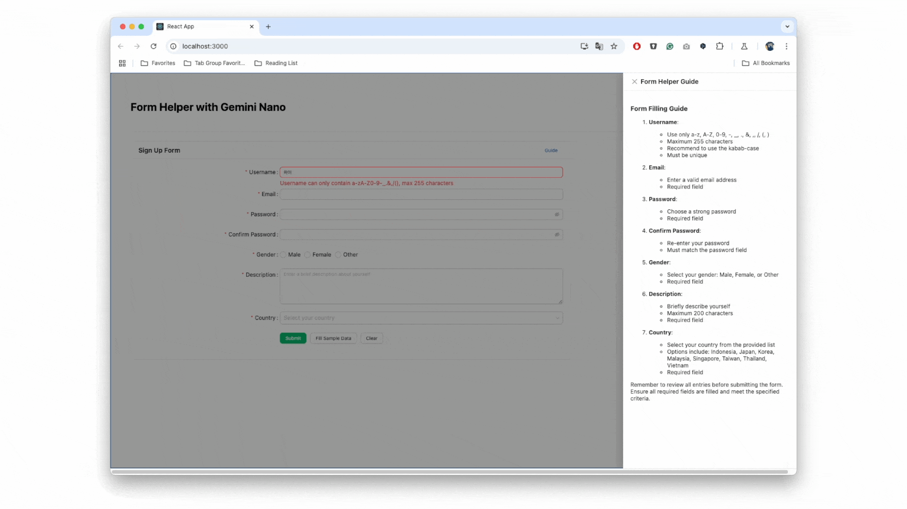

## Project Overview

Form Helper Chrome is an innovative project developed to enhance user experience in web form interactions. Created as part of the [Google Chrome Built-in AI Challenge](https://googlechromeai.devpost.com), this project aims to provide real-time, personalized solutions for form errors using Chrome's built-in AI capabilities. The core objective is to reduce user frustration and improve data entry efficiency by offering intuitive, contextual guidance.

{::options parse_block_html="false" /}


{::options parse_block_html="true" /}

## Situation

Form errors have been a persistent challenge in web development for decades. Despite the availability of guidelines and frameworks like Google's Material Design and Ant Design, users continue to struggle with filling out forms correctly. This leads to increased frustration and support calls. As a product designer, I saw the need for a more intuitive solution that could provide real-time guidance, reducing errors and enhancing the overall user experience.

{::options parse_block_html="false" /}
{% include post-components/quote.html
   full_width = true
   background_color = "#E2E0F9"
   font_color = "#3d3d3d"
   images = "../images/projects/2024-form-helper-chrome/1-reference-1.png"
   text = "<span style='font-size: 20px; background-color: #333; color: #fff; padding: 2px 4px;'>\"Why is it so hard to get users to fill things in right? Guides go unread, red errors get ignored, and support calls 
   go up. Do we need to hold their hand?\"</span> <br/><br/> If you're a designer, you've probably thought this too, right? 😅"
%}
{::options parse_block_html="true" /}
<br/>
<br/>

## Task

The primary task was to create a seamless user experience for form completion by leveraging AI technology. Key objectives included:

{::options parse_block_html="false" /}

<br/>
{% include post-components/quote.html
   full_width = false
   background_color = "#78FCE6"
   font_color = "#555"
   images = "../images/projects/2024-form-helper-chrome/task2-2.png"
   text = "<span style='font-size: 20px; background-color: #333; color: #fff; padding: 2px 4px;'>Cost-Effective Solution</span><br/><br/> Design a solution that eliminates both implementation costs (no server setup, easy integration) and operational costs (no API fees, minimal maintenance) while providing instant AI assistance."
%}
<br/>
{::options parse_block_html="true" /}

With these objectives in mind, I aimed to create an intuitive, accessible solution that would transform frustrating form interactions into smooth experiences through AI-powered assistance. To achieve this, I began with thorough research and prototyping. 

## Action

### Research on Personalized AI Feedback

I conducted research to understand how AI could provide more personalized and effective form guidance. This investigation focused on the potential of AI to transform static error messages into dynamic, context-aware assistance.

{::options parse_block_html="true" /} 
<div class="timeline-section full-width align-left">
<div class="outer">
<div class="timeline-item">
<span class="timeline-date">Step 1: Current State Analysis</span>

#### Form Error Message Analysis
- Extracted and analyzed error messages and helper texts from my product's forms
- Reviewed guide page access patterns through analytics data
- Tracked user interaction with help documentation


Key Finding: Due to limited error text length and format (text-only), users often face difficulties understanding the issues. While separate documentation is provided as a solution, data shows that users rarely rely on these lengthy guides.
</div>

<div class="timeline-item">
<span class="timeline-date">Step 2: Solution Exploration</span>
#### AI as a Potential Solution

Based on the analysis, I identified that an AI-powered solution could address these limitations by:
- Summarizing relevant documentation based on the specific error context
- Providing clearer explanations in a more flexible format
- Delivering personalized guidance at the moment of error

This exploration led to a clear hypothesis: Instead of static text messages, if we could present just the right information in a more comprehensive format using AI, we could better solve these form completion challenges.
</div>
</div>
</div>
{::options parse_block_html="false" /}


### Building a Zero-Cost AI Solution

{::options parse_block_html="true" /} 
<div class="timeline-section full-width align-left">
<div class="outer">
<div class="timeline-item">
<span class="timeline-date">Step 1: Finding Inspiration</span>

#### Chrome's Built-in AI Discovery
While watching Google I/O, I was particularly intrigued by Chrome's announcement of built-in AI capabilities. The presentation showcased how Gemini Nano would be integrated directly into the browser, enabling AI features without external dependencies.

<iframe width="560" height="315" src="https://www.youtube.com/embed/D7dA5KY5FEo?si=jNPCAH3xagijfo6f" title="YouTube video player" frameborder="0" allow="accelerometer; autoplay; clipboard-write; encrypted-media; gyroscope; picture-in-picture; web-share" referrerpolicy="strict-origin-when-cross-origin" allowfullscreen></iframe><br><br>

This revelation sparked my interest - it seemed to perfectly address the challenges I was facing with form assistance implementation.
</div>

<div class="timeline-item">
<span class="timeline-date">Step 2: Technical Implementation</span>

#### Building with Chrome's Built-in AI
After joining the [Chrome AI early preview program](http://goo.gle/chrome-ai-dev-preview-join), I discovered the potential of the Prompt API. I designed a system that processes error messages, form data, and documentation to generate contextual assistance:



The successful integration of these elements through the Prompt API proved that intelligent, context-aware form assistance was not just possible, but highly effective.
</div>

<div class="timeline-item">
<span class="timeline-date">Step 3: Integration Design</span>

#### Streamlining Developer Experience
To make the solution easily adoptable, I focused on creating flexible integration options:
- Simple component-based implementation
- Customizable UI themes (dark/light modes)
- Configurable styling options
- Easy error state integration

<iframe width="560" height="315" src="https://www.youtube.com/embed/MeugkhYE848?si=vqZbIWw6XA--RAjR" title="YouTube video player" frameborder="0" allow="accelerometer; autoplay; clipboard-write; encrypted-media; gyroscope; picture-in-picture; web-share" referrerpolicy="strict-origin-when-cross-origin" allowfullscreen></iframe><br><br>

The video above demonstrates how developers can quickly implement and customize the AI-powered form assistance while maintaining their application's design consistency, furthering our goal of a zero-cost solution.
</div>
</div>
</div>
{::options parse_block_html="false" /}

## Result

This project evolved from a concept into two significant achievements - a practical open-source solution and an entry in Google's prestigious AI challenge.

### Published as Open Source

The project was successfully published as an npm package, making it easily accessible to developers worldwide. The package provides a simple yet powerful way to implement AI-powered form assistance:

```bash
npm install form-helper-chrome
```

### Chrome Built-in AI Challenge

With confidence in the project's potential, I submitted it to the Chrome Built-in AI Challenge. Through this process, I collaborated with fellow developers who helped identify and fix several edge cases, making the solution more robust. 

{::options parse_block_html="false" /}
{% include post-components/quote.html
   full_width = true
   background_color = "#000"
   font_color = "#fff"
   images = "https://img.youtube.com/vi/6LOtqprIeGQ/0.jpg"
   text = "I submitted this project to the Google Chrome Built-in AI Challenge, a competition focused on creating innovative solutions with Chrome's AI capabilities.<br/><br/><a href='https://devpost.com/software/form-helper-chrome' style='display: inline-flex; align-items: center; padding: 10px 20px; background-color: #4285F4; color: white; text-decoration: none; border-radius: 5px; font-weight: bold;'><svg width='24' height='24' viewBox='0 0 24 24' fill='none' xmlns='http://www.w3.org/2000/svg' style='margin-right: 10px;'><path d='M12 2C6.48 2 2 6.48 2 12C2 17.52 6.48 22 12 22C17.52 22 22 17.52 22 12C22 6.48 17.52 2 12 2ZM12 20C7.59 20 4 16.41 4 12C4 7.59 7.59 4 12 4C16.41 4 20 7.59 20 12C20 16.41 16.41 20 12 20ZM11 7H13V13H11V7ZM11 15H13V17H11V15Z' fill='white'/></svg>Learn More </a>"
%}
<br/><br/>
{::options parse_block_html="true" /}

Regardless of the hackathon results, these experiences and connections made the journey worthwhile and provided valuable insights for future AI-powered web development projects.

## Conclusion

As a product designer, leading this project from concept to completion has been an incredibly rewarding experience. I successfully transformed a common UX challenge into a practical solution, leveraging cutting-edge AI technology while maintaining a designer's perspective on usability and integration.

The journey from identifying the problem to publishing an open-source solution and participating in Google's Chrome Built-in AI Challenge has validated my belief that designers can also be able to participate in technical innovation. This project demonstrates that with the right approach, we can create solutions that are both technically sophisticated and beautifully simple to use.

Moving forward, I'm excited to continue exploring the intersection of AI and design, finding new ways to enhance user experiences while keeping implementation simple and accessible for developers.

