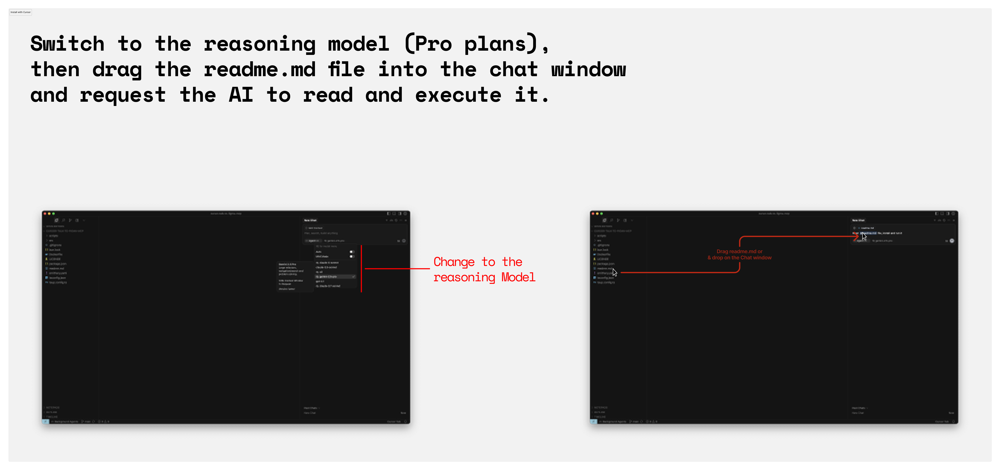
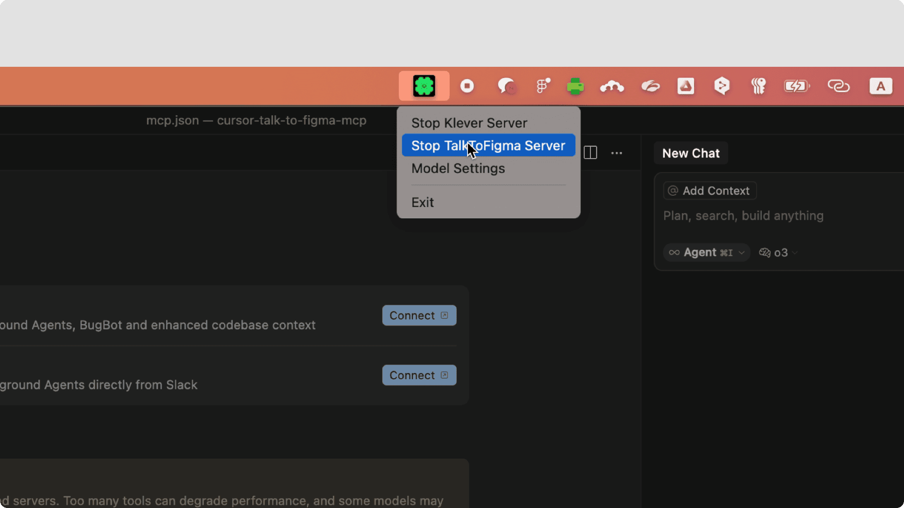

## Introducing TalkToFigma MCP

The `cursor-talk-to-figma-mcp` project, initiated by Sonny Lazuardi, is an innovative "vibe design" tool that enables Cursor Agentic AI to directly communicate with Figma and automate design workflows.

As the **2nd Major Contributor of this 5.5k+ Stars project**, I **directly developed core design automation features** that enable AI to handle repetitive tasks designers face in Figma—dummy data population, annotation conversion, instance override propagation, DevMode integration—with just natural language commands. These features replace workflows previously handled by multiple plugins (Google Sheets, Eightshapes Specs, Instance Util, etc.) with a single unified AI automation system.

 

  <a href="https://github.com/grab/cursor-talk-to-figma-mcp" target="_blank" style="display: inline-flex; align-items: center; padding: 10px 20px; background-color: #333333; color: white; text-decoration: none; border-radius: 5px; font-weight: bold;">
    
    View cursor-talk-to-figma-mcp
  </a>

 

## The Spark & Action

This project began with strong inspiration from `cursor-talk-to-figma-mcp`, started by Sonny Lazuardi, Grab's Lead UX Engineer, to automate the endless repetitive tasks (text updates, layer organization, etc.) that designers face in Figma.

While the original project started as a tool for vibe design, I was convinced of its potential to become a core platform for **design automation and productivity enhancement** beyond just an auxiliary tool.

My approach was simple. Instead of worrying about **"Vibe design? AI prompting? What's trendy to build?"**, I just started converting Figma plugins I used daily into MCP tools one by one. I didn't expect this small hobby would open up a whole new world.

I immediately started code contributions, and during the process of migrating daily work plugins to MCP tools, I experienced each feature evolving to a completely different dimension when meeting Cursor AI.

### Core MCP Automation Features I Developed

| Feature | Referenced Plugin | MCP Magic | 
|---------|-------------------|-----------|
| **Smart Data Population** | Google Sheets Sync | Simply say "populate these cards with @Web 5 Korean restaurant data," and AI searches and fetches real data to automatically fill each card's text and prices. Screenshots or JSON data also work! | 
| **Legacy Annotation Converter** | Eightshapes Specs | Say "upgrade the annotations," and AI analyzes hundreds of annotations, understands their position and content, and upgrades them to engineer-handover-ready high-quality annotations | 
| **Instance Override Propagation** | Instance Util | Say "fill all empty slots in selected nodes with source instance's," and AI understands component structure and applies instance overrides in bulk |
| **DevMode Integration** |  | Say "find accessibility issues in this screen and add them as annotations," and AI reads DevMode data (colors, typography, spacing), performs multi-angle UX analysis, and automatically generates improvement suggestions as Figma annotations |

**Key Difference**: While existing plugins only automated predefined workflows, MCP **operates flexibly** as AI understands context and follows natural language commands. You can converse and instantly handle complex tasks as if you have a designer colleague sitting next to you.

*Various Contribution Activities*

{::options parse_block_html="false" /}

<blockquote class="twitter-tweet">
✨ Remember Google Sheets sync? Now imagine that with <a href="https://twitter.com/cursor_ai?ref_src=twsrc%5Etfw">@cursor_ai</a> ! Added smart data population to <a href="https://twitter.com/sonnylazuardi?ref_src=twsrc%5Etfw">@sonnylazuardi</a>&#39;s Talk-to-Figma MCP. This is just the beginning of how AI transforms design workflows 🪄 <a href="https://t.co/490fdRWYyt">https://t.co/490fdRWYyt</a> <a href="https://twitter.com/figma?ref_src=twsrc%5Etfw">@figma</a> <a href="https://twitter.com/hashtag/figmaMCP?src=hash&amp;ref_src=twsrc%5Etfw">#figmaMCP</a> <a href="https://twitter.com/adispezio?ref_src=twsrc%5Etfw">@adispezio</a> <a href="https://twitter.com/zoink?ref_src=twsrc%5Etfw">@zoink</a>
&mdash; Jude_Park (@dusskapark) <a href="https://twitter.com/dusskapark/status/1907306574810693691?ref_src=twsrc%5Etfw">April 2, 2025</a></blockquote>
|||
<blockquote class="twitter-tweet">
1/5 &quot;Vibe design&quot;? &quot;Vibe coding&quot;? What about &quot;vibe instance swap&quot;? 🙄 THREAD: 3 productivity hacks using <a href="https://twitter.com/figma?ref_src=twsrc%5Etfw">@figma</a> MCP that will save you HOURS every week ⚡️ Starting with &#39;Instance swap+overrides&#39;: <a href="https://t.co/Lrshzs6k0d">pic.twitter.com/Lrshzs6k0d</a>
&mdash; Jude_Park (@dusskapark) <a href="https://twitter.com/dusskapark/status/1912179210892059099?ref_src=twsrc%5Etfw">April 15, 2025</a></blockquote>
|||
<blockquote class="twitter-tweet">
<a href="https://twitter.com/figma?ref_src=twsrc%5Etfw">@figma</a> &#39;s native annotations are amazing, but what about all those legacy markers you&#39;ve created?  With <a href="https://twitter.com/cursor_ai?ref_src=twsrc%5Etfw">@cursor_ai</a> and <a href="https://twitter.com/sonnylazuardi?ref_src=twsrc%5Etfw">@sonnylazuardi</a> &#39;s Figma MCP, converting them is just one conversation away! Tell the AI to follow the strategy, and watch the magic happen ✨<a href="https://twitter.com/zoink?ref_src=twsrc%5Etfw">@zoink</a> <a href="https://twitter.com/adispezio?ref_src=twsrc%5Etfw">@adispezio</a> <a href="https://t.co/iOHjQdZhWe">https://t.co/iOHjQdZhWe</a> <a href="https://t.co/swPlYDdXV0">pic.twitter.com/swPlYDdXV0</a>
&mdash; Jude_Park (@dusskapark) <a href="https://twitter.com/dusskapark/status/1908940072067731503?ref_src=twsrc%5Etfw">April 6, 2025</a></blockquote>
|||
<blockquote class="twitter-tweet">
Figma MCP Magic(5) is here! In this clip, I combine DevMode MCP with Talk to Figma to get instant, multi-angle UX feedback—automatically annotated right inside Figma. Super fast. Super smart. Watch the magic 🪄 👉 <a href="https://t.co/1mIj917LiV">https://t.co/1mIj917LiV</a><a href="https://twitter.com/hashtag/Figma?src=hash&amp;ref_src=twsrc%5Etfw">#Figma</a> <a href="https://twitter.com/zoink?ref_src=twsrc%5Etfw">@zoink</a> <a href="https://twitter.com/sonnylazuardi?ref_src=twsrc%5Etfw">@sonnylazuardi</a>
&mdash; Jude_Park (@dusskapark) <a href="https://twitter.com/dusskapark/status/1937215717868495178?ref_src=twsrc%5Etfw">June 23, 2025</a></blockquote>



{::options parse_block_html="true" /}

Through developing these core features, I became the **[2nd Major Contributor](https://github.com/dusskapark)** of [Sonny Lazuardi](https://github.com/sonnylazuardi)'s project, and directly led the growth and expansion of this **5.5k+ GitHub Stars** project.

---

## Advocacy & Validation

Beyond just development, I **directly served as an Advocate** to spread the value of this innovative tool. I planned and executed workshops and webinars to help as many designers as possible experience the project's potential. Through this process, I discovered both enthusiastic support from designers and fundamental barriers blocking the innovation's spread.

### Light: Explosive Interest and Enthusiastic Response

**Internal Organization Evangelism:**

I actively shared productivity enhancement methods using MCP through internal company channels. Together with fellow designer Lucy, I presented MCP usage at the **Design All-hands meeting**, and subsequently hosted **over 6 workshops** across various design organizations.

{::options parse_block_html="false" /}

{::options parse_block_html="true" /}

**Community Evangelism:**

{::options parse_block_html="false" /}
<iframe width="560" height="315" src="https://www.youtube.com/embed/smE8OMN1Qjs?si=HKSD5jmDiA8NEIPW" title="YouTube video player" frameborder="0" allow="accelerometer; autoplay; clipboard-write; encrypted-media; gyroscope; picture-in-picture; web-share" referrerpolicy="strict-origin-when-cross-origin" allowfullscreen></iframe>
{::options parse_block_html="true" /}

---
As a Friends of Figma Seoul organizer, I planned the webinar **"MCP Design Automation Workshop to Reduce Work Time"**. Despite the somewhat challenging topic of code/development, **all 80 registration slots were filled within just a few hours**, showing tremendous interest, and received very positive feedback in post-workshop surveys.

To help designers easily relate to and fall in love with MCP tool magic, I created a [Figma playground file](https://www.figma.com/community/file/1513760524697897204/design-automation-with-figma-mcp) bundling various prompts and real use cases. I also used AI to create fun cartoons to convey complex technical concepts in a friendly and intuitive way.

{::options parse_block_html="false" /}

{::options parse_block_html="true" /}

### Shadow: **"Looks great... but too difficult."**

However, during post-workshop user follow-up, I faced a shocking reality. Behind the enthusiastic responses was feedback that appeared consistently both internally and externally:
The actual data told a harsher truth. I introduced CTTF to over 130 designers through internal workshops and FoF webinars. However, it didn't significantly impact actual user metrics.
Even after the webinar where 80 people filled all slots within hours and showed enthusiasm, there was little change in CTTF's GA4 tracking data. **Interest was explosive, but it didn't translate into actual usage.**

- Internal workshop **50 people** → **No impact** on actual Cursor active user metrics
- FoF webinar **80 people** → GA4 data analysis showed **less than 10%** regular users

The **root cause** was that this JavaScript-based CTTF MCP tool had high entry barriers for non-engineers. Since it wasn't an easily installable plugin-form tool, repetitive issues blocking progress occurred during installation or re-execution. For example:

| Problem | Description |
| --- | --- |
| Installation Stage Barriers | Installing `homebrew`, configuring `node js` environment, installing `bun.sh`, executing terminal commands—technical barriers too high for non-engineers |
| Re-usage Stage Barriers | Even after successful installation, users couldn't find the same project folder again or didn't remember how to use the `bun socket` command for next usage |
| Other Operational Barriers | Security-related issues or individual environment configuration problems often made independent usage impossible without 1:1 troubleshooting |

{::options parse_block_html="false" /}

{::options parse_block_html="true" /}

**Not an Individual Problem, but the Entire Community's Pain Point:**

This wasn't just our organization's problem. Similar issues were easily found throughout the Figma community.
YouTube clips of popular Figma influencers like [Yiseo](https://www.youtube.com/@figma_tutor) explaining how to set up Cursor and MCP for designers are still easily found. Cases of recreating [long-form tutorials](https://www.youtube.com/watch?v=WN07X82hh-o&t=207s) based on user requests were easily discoverable.

Ultimately, this discovery presented me with a clear challenge:

> **What's the point of innovative technology if it can't reach actual users?**

I decided to solve this problem head-on.

---

## Solution & Execution

### Attempt 1: Can't AI Solve This Easily?

Faced with the shocking 90% churn rate data, many suggested "strengthen user education" and "create more detailed documentation." I first tried that direction.

I **directly developed** [`DRAGME.md`](https://youtu.be/C0OVOXe-9ek) where users drag a file into Cursor and AI automatically installs and configures the CTTF environment. Installation success rates actually improved. But **the fundamental problem wasn't solved.**

Installation stage barriers, re-usage stage barriers, operational barriers... the problems discovered earlier still existed, and the same user questions kept repeating. No matter how well AI helped, as long as users depended on **environments they couldn't control** (terminal, homebrew, environment variables), designers' **psychological anxiety** wasn't resolved. That's when I realized.

The enthusiastic interest shown by hundreds of designers was real. The problem wasn't them. **The tool itself wasn't designed for non-engineers.** Because Cursor was, by nature, an IDE—a tool for engineers.

> **The real solution wasn't educating users or automating processes, but eliminating the need for those processes entirely.**

The question became clear: **"How can designers leverage CTTF's powerful features without barely touching an IDE?"**

There was only one answer. Create **an independent desktop app with one-click installation, everything managed inside the app, and users never having to worry about system-level concerns**.

### Attempt 2: What if We Build a Desktop App?

I couldn't just keep thinking about it. Over the weekend, I created a desktop app prototype by referencing code from other existing apps I had at home.

One-click execution, system tray persistence, automatic server management—a simple app solving all the problems designers faced. I had a light conversation with internal UX engineers with working proof.
However, the company couldn't proceed immediately. The idea was good, but it didn't align with the company's main direction, and most importantly, there wasn't available manpower. It was an understandable decision, but it made me think about various things.

### Attempt 3: Directly Developing to Solve User Problems Until the End

My conclusion was that there was a clear user problem I witnessed with my own eyes, and it was too early to simply give up. So I decided to directly develop and solve user problems until the end, even during my personal weekend time. This was also a challenge. Although I had experience from the Klever project, Kotlin Compose Desktop was still a relatively new technology with limited references. However, I thought of it as an opportunity to **achieve problem-solving and learning simultaneously**.

Through my network, I showed the prototype to my friend engineer [Jin](https://www.linkedin.com/in/jinyoung-jang-a3a827b5/), who was taking a career break, and proposed collaboration. She also resonated with the problem's value and solution direction. We conducted coding sessions every weekend at church, developing the project together.

Based on the initial backbone I created, Jin elevated the project to a completely new level. We created a desktop app equipped with everything—cross-platform support using Kotlin Compose Multiplatform, sophisticated UI based on Material Design, and stable server management—within just a few study sessions, and together released this project under the name [TalkToFigma Desktop](https://github.com/FigmaAI/TalkToFigmaDesktop).

{::options parse_block_html="false" /}
<iframe width="560" height="315" src="https://www.youtube.com/embed/DInyZLnEgmA?si=Ls2VFJxgwzmbzMeZ" title="YouTube video player" frameborder="0" allow="accelerometer; autoplay; clipboard-write; encrypted-media; gyroscope; picture-in-picture; web-share" referrerpolicy="strict-origin-when-cross-origin" allowfullscreen></iframe>
{::options parse_block_html="true" /}

### Core Features: Breaking Down Installation and Usage Barriers

TalkToFigma Desktop completely reconstructed the complex CLI-based approach.

| Feature | Implementation | Section 2 Problem Solved |
|---------|----------------|--------------------------|
| **One-Click Installation** | Download executable file (.dmg, .exe) | Removed installation stage barriers |
| **Simple MCP Installation & Execution** | Copy-paste to install MCP anywhere supporting MCP agents like Cursor, Gemini CLI, and run standalone | Removed operational barriers |
| **System Tray UI** | One-click to start and stop server in background | Removed re-usage stage barriers |
| **Tutorial Provision** | Provided tutorials for easy designer usage | Removed user education stage barriers |

### User Testing: Together with Real Designers

I registered the initial beta version in TestFlight and distributed it to 20 designers. This time was different.

Unlike previous workshops, I simply sent the app download link without any additional explanation or 1:1 support. I just said "Install and try it." Unexpected issues (security warnings, port conflicts, etc.) emerged, but this time, with just simple tutorials, they could open Cursor, install MCP, and use it immediately without installation stage errors. After implementing several stability patches and observing a bit more, the results were even clearer.

| Metric | Result | Notes |
|--------|--------|-------|
| Installation Success Rate | **100%** ||
| Average Installation Time | **30+ minutes → Within 2 minutes** | 93% reduction |
| Re-execution Success Rate | **Below 10% → Above 85%** | 8.5x improvement |
| 1-Week Retention | **10% → Above 65%** | 6.5x improvement |
| Events per Session | **10 → Above 41** | 4.1x increase |

Particularly meaningful was the **increase in events per session**. This was evidence that designers were using CTTF in actual projects, not just following tutorials.

> "Wow, now I can really use it. Just open the app and launch Cursor—that's it!"
>
> "Finally, I can recommend it to other designers. I couldn't before because I had to help them..."

---

## Conclusion: Impact, Growth & Learnings

I implemented the idea in my head as a prototype, enhanced its completeness through coding sessions at church, and proved its value with actual user data. As the **2nd Major Contributor of a 5.5k+ Stars project**, I developed core features and created an impact of **4.1x usability improvement** with the desktop app.

This achievement led to bigger opportunities. Sonny's original project moved to the [official Grab repository](https://www.grab.com/sg/inside-grab/stories/a-grab-engineer-built-this-design-tool-for-his-team-now-were-improving-it-for-everyone/) as part of Grab's open-source initiative, and the desktop app I developed also gained collaboration opportunities with Grab.

Both projects remained MIT license open source while receiving official Grab support. As the **2nd Major Contributor**, I'm leading the continuous growth and innovation of both projects, contributing to help more designers benefit from AI-powered design automation.

### What I Learned from This Journey

Through this project, I deeply realized the importance of **leadership in discovering problems and proactively creating solutions**, beyond just contributing code.

**The Power of User-Centric Thinking:**

The data that 80 designers who were enthusiastic in workshops actually used it less than 10% was shocking, but simultaneously gave the most important insight. I learned that **whether users can actually use it** is far more important than the innovation of the technology.

**The Value of Execution:**

I proved the idea rejected by the company by directly building it on weekends without giving up. Sometimes **one working prototype can be a stronger argument** than persuasion.

**The Power of Community:**

A project that would have been impossible alone grew through collaboration with Jin, Lucy, Sonny, and numerous testers and workshop participants. **True innovation comes from collaboration.**

---

**I will continue to bridge design and engineering, creating innovations that deliver value to actual users.**

> "When the user problem is clear, the fastest way to prove it is to build it and show them."

---

## References & Links

{::options parse_block_html="false" /}


    
    

        
cursor-talk-to-figma-mcp: Multiple plugins into one AI system

        <a href="https://github.com/grab/cursor-talk-to-figma-mcp">github.com/grab/cursor-talk-to-figma-mcp</a>
    

    
    

        
TalkToFigma Desktop: Desktop app accessible to all designers

        <a href="https://github.com/FigmaAI/TalkToFigmaDesktop">github.com/FigmaAI/TalkToFigmaDesktop</a>
    

    
    

        
Workshop Playground (EN): Design Automation with Figma MCP

        <a href="https://www.figma.com/community/file/1513760524697897204">figma.com/community/file/1513760524697897204</a>
    

    
    

        
Workshop Materials (KR): MCP Design Automation Workshop Materials

        <a href="https://www.figma.com/community/file/1513759391089024242">figma.com/community/file/1513759391089024242</a>
    

{::options parse_block_html="true" /}

