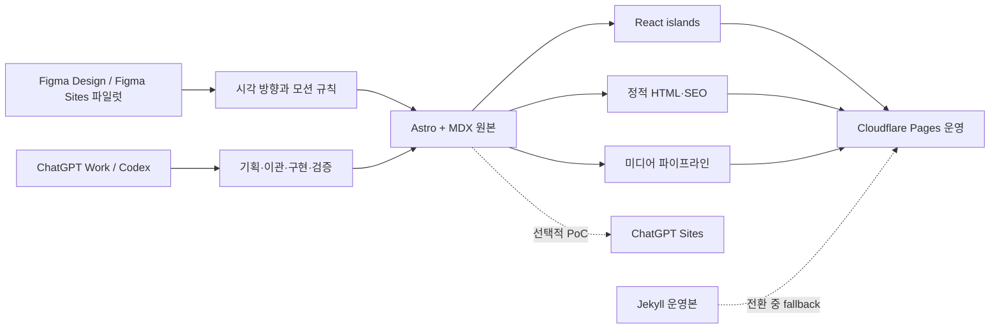
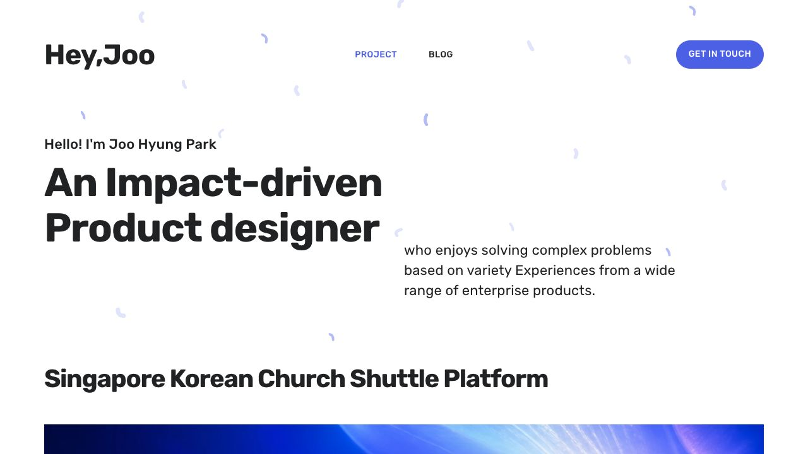
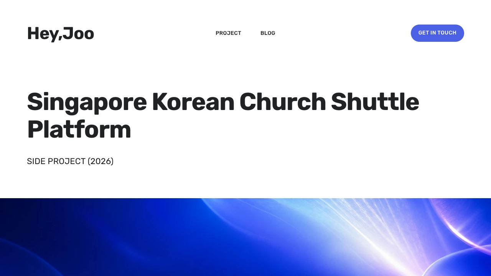
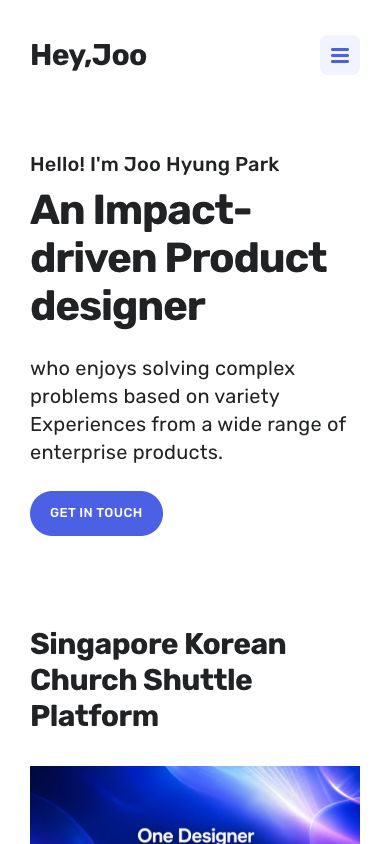
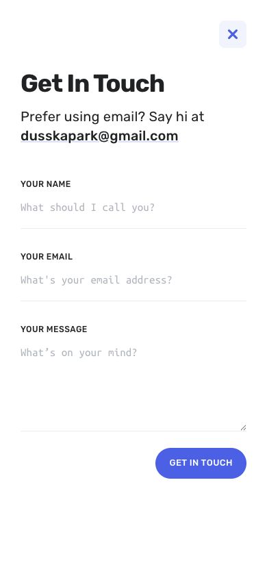

# 포트폴리오 리팩터링·리뉴얼 기획안

- 작성일: 2026-07-30
- 현재 사이트: [api.metadata.co.kr](https://api.metadata.co.kr)
- 범위: 현행 진단, 플랫폼 비교, 권장 아키텍처, 콘텐츠/UX 방향, 점진적 이관 계획
- 이번 단계에서 하지 않는 일: 신규 UI 구현, 도메인 전환, 운영 사이트 배포

## 1. 결정 요약

가장 적절한 방향은 다음 조합이다.

1. **ChatGPT Work/Codex**를 기획·리팩터링·구현·검증 파트너로 사용한다.
2. **Astro + MDX Content Collections + 작은 React islands**를 최종 사이트의 소스 구조로 사용한다.
3. **Cloudflare Pages**를 1차 운영 호스트로 사용한다.
4. **Figma Sites**는 홈과 대표 사례 연구의 시각·모션 콘셉트 파일럿에 사용한다.
5. **ChatGPT Sites**는 로컬 Git 프로젝트를 원본으로 둔 상태에서 선택적 배포 PoC로만 검증한다.
6. **GitHub Pages/Jekyll은 전환 완료 전까지 롤백 가능한 레거시 운영본**으로 유지한다.

핵심은 “SSG라서 재미가 없다”가 아니라, 현재 사이트에서 콘텐츠·테마 DOM·jQuery 플러그인·Ajax 페이지 교체가 한 생명주기로 묶여 있는 것이 표현과 유지보수의 실제 병목이라는 점이다. Astro 역시 정적 HTML을 만들 수 있지만, 필요한 부분에만 React, Motion, GSAP, Canvas/WebGL 같은 인터랙션을 넣을 수 있다. 즉 **정적 배포와 정적인 경험은 같은 말이 아니다.**

## 2. 먼저 바로잡아야 할 선택의 층위

후보들은 같은 종류의 제품이 아니다.

| 층위 | 후보 | 이 프로젝트에서의 역할 |
|---|---|---|
| 기획·제작 파트너 | ChatGPT, ChatGPT Work, Codex | 조사, 콘텐츠 모델링, 코드 이관, 테스트, 브라우저 검증 |
| 시각 제작 플랫폼 | Figma Sites, Framer, Webflow | 캔버스 기반 디자인, CMS, 모션, 플랫폼 호스팅 |
| 코드 프레임워크 | Astro, Next.js | 소스 코드·라우팅·콘텐츠·인터랙션의 실제 구조 |
| 호스팅 | Cloudflare Pages, Vercel, ChatGPT Sites, GitHub Pages | 빌드 산출물 배포, 도메인, preview, redirects, analytics |

따라서 추천안은 “OpenAI 대신 Astro”가 아니다. **OpenAI 도구로 Astro 기반 사이트를 만들고, 소스는 Git에 소유하며, 운영 호스트는 교체 가능하게 유지하는 것**이다.



## 3. 현행 기술 기준선

### 3.1 현재 구조

- Ruby 3.4.9, Jekyll 4.4.1, Kramdown, Sass, `jekyll-paginate`, `jekyll-sitemap`.
- `master` 브랜치 push 시 GitHub Actions가 `_site`를 생성해 GitHub Pages로 배포한다.
- 로컬 빌드는 정상이며 약 0.6초가 걸린다. 빌드 실패가 이번 리뉴얼의 원인은 아니다.
- 정상 프로젝트 17개, 글 4개, 이미지/미디어 361개가 있다.
- 생성 결과는 431개 파일, 약 316MB다.
- `images/`는 약 315MB이며, 1MB를 넘는 파일 87개, 5MB를 넘는 파일 11개가 있다.

### 3.2 실제 결합 문제

- 전역 링크를 가로채 History.js와 jQuery `.load()`로 본문 일부만 교체한다.
- 교체 후 페이지별 기능을 다시 초기화하기 위해 `pageFunctions()`와 별도 `MutationObserver`가 공존한다.
- 갤러리 하나가 imagesLoaded, Owl Carousel, Waypoints, Masonry, Fluidbox에 동시에 결합된다.
- jQuery 3.2.1, TypeIt, Flickity, 112KB 수동 번들을 전 페이지가 불러온다.
- 17개 프로젝트 문서에 Liquid include가 78번 사용된다.
  - gallery 53
  - video 11
  - quote 11
  - store badges 3
- 12개 문서가 raw HTML, inline style 또는 iframe에 의존한다.
- 일부 콘텐츠는 Kramdown 전용 `parse_block_html` 토글을 사용한다.

이 구조에서는 새로운 인터랙션 하나를 넣을 때 기존 Ajax 이동, 플러그인 초기화, DOM 재작성과 충돌할 가능성이 높다. 단순히 jQuery 문법을 현대 JavaScript로 바꾸는 것만으로는 해결되지 않는다.

### 3.3 데이터·SEO·운영 위험

- `featured_image`, `gallery_images`가 문자열과 배열로 혼재하고 선행 `/`도 일관되지 않다.
- 제목 일부가 `<br>`을 포함해 화면 제목과 SEO 제목이 분리돼 있지 않다.
- 파일명에 공백과 한글이 있고 PNG, GIF, MOV, MP4, PDF가 섞여 있다.
- Ajax 이동은 본문과 `document.title`만 바꾸고 description, Open Graph, `<html lang>`을 갱신하지 않는다.
- 한국어 글에도 기본 레이아웃의 `lang="en"`이 적용된다.
- `_config.yml`의 exclude 정책이 없어 `research/` 아래 GA4 CSV/JSON 등 원자료도 현재 빌드 결과로 복사된다. 공개 의도를 별도로 확인해야 한다.
- front matter가 없는 `_projects/test.md`도 빌드 산출물에 복사된다.
- 연락 폼의 실제 클래스와 기존 JavaScript 검증 selector가 달라 검증 코드가 사실상 동작하지 않는다.
- Google Universal Analytics `UA-...` 설정은 현재 분석 체계로 교체해야 한다.
- 17개 프로젝트의 OG/Twitter image 경로는 프로젝트 본문에서 쓰는 `/images/projects/` prefix와 다르게 생성돼 깨진 URL이 될 가능성이 높다.
- hidden 프로젝트, demo post, thanks 페이지, PDF와 raw research 자료까지 sitemap에 포함된다.
- 프로젝트 자산 340개 중 정적 참조 기준 약 132개, 96MB가 미사용 후보라서 삭제 전 검증이 필요하다.

### 3.4 콘텐츠는 부족하지 않고 큐레이션이 부족하다

- 홈은 visible 프로젝트 16개를 같은 무게로 모두 보여 준 뒤에야 About과 Writing을 노출한다.
- 현재 강점을 가장 정확히 설명하는 문장인 “Product builder designing AI/ML, developer experience, and tech infrastructure products since 2012”는 홈 하단에 묻혀 있다.
- TalkToFigma 사례에는 아직 `IMG_SLOT`과 “수치는 추후 공개” 같은 제작 메모가 남아 있지만, 별도 MCP Magic 회고에는 31,360 users, 570,373 calls, 94.1% success 등 더 강한 증거가 있다. 두 콘텐츠는 하나의 대표 case와 하나의 deep-dive writing으로 재구성하는 편이 낫다.
- Klever에는 1,076 users, 248 saves, 행사 등록 400+와 내부 채택, LIFF에는 배포 후 문의 40% 증가, TFJS에는 오픈소스와 글로벌 발표라는 강한 결과가 이미 있다. 새 사례를 더 만드는 것보다 기존 결과를 먼저 편집해야 한다.
- Blog에는 theme demo post가 실제 글처럼 노출되고, 홈의 최근 글 3칸 중 2칸을 같은 MCP 글의 한·영 번역이 차지한다.
- Blog 설명, thanks 페이지, footer에 구입한 Jekyll theme의 문구와 링크가 남아 있어 신뢰를 낮춘다.
- 오래된 LINE GAME Developers, GDC, LOOKBOOK은 하나의 플랫폼/디자인 시스템 진화 사례로 통합할 여지가 있다.

## 4. 현행 경험 감사

### 감사 목표

채용 담당자·협업 파트너가 모바일 또는 데스크톱으로 접속해 다음을 빠르게 판단할 수 있는지 확인했다.

1. 이 사람이 현재 어떤 제품 디자이너/빌더인지
2. 어떤 사례를 먼저 읽어야 하는지
3. 사례에서 문제·기여·성과를 빠르게 훑을 수 있는지
4. 신뢰를 얻은 뒤 쉽게 연락할 수 있는지

### Step 1 — 데스크톱 홈: 보통



강점:

- 큰 타이포그래피, 넓은 여백, 일관된 포인트 색상으로 기본 인상은 깨끗하다.
- 최신 프로젝트가 먼저 노출되고, 프로젝트 상세 진입점은 명확하다.

위험:

- 첫 문장이 일반적이고 영어 문법/대소문자 오류가 있어 현재의 AI·DX·product builder 정체성이 약하게 전달된다.
- 16개 프로젝트가 모두 홈에 이어져 데스크톱 전체 높이가 약 19,905px다.
- 프로젝트를 연대순으로 훑어야 하며 “대표 사례”, “AI/ML”, “developer experience”, “product building” 같은 판단 기준이 없다.
- 이미지 링크의 대체 텍스트가 비어 있고, 이미지로만 된 링크가 반복된다.
- 홈의 로컬 이미지 전송량은 현재 산출물 기준 약 8.4MB이며 카드 이미지에 lazy loading과 고유한 alt가 없다.

### Step 2 — 대표 사례 연구: 보통 이하



강점:

- 최근 사례는 실제 문제, SDLC, 플랫폼 전환과 회고가 풍부하다.
- 긴 글을 담을 수 있는 읽기 폭과 기본 타이포그래피는 안정적이다.

위험:

- 대표 사례 하나의 전체 높이가 약 27,130px이며 첫 화면에 역할, 결과, 핵심 수치, 읽기 시간, 목차가 없다.
- 방문자는 중요한 결론을 얻기 전에 긴 서사를 읽어야 한다.
- Ajax 이동 테스트 중 이전 scroll 위치가 21,009px로 유지되는 상태가 관찰됐다. 전역 링크 가로채기와 페이지 교체 방식이 실제 탐색 안정성을 해치고 있다.
- 사례마다 동일한 “거대한 제목 + 긴 본문” 틀을 사용해 프로젝트 고유의 시스템·과정·결과가 시각적으로 구분되지 않는다.
- 프로젝트 상세 template에는 summary, duration, constraints, outcome, related work, next project가 없어 방문자가 긴 본문을 읽기 전에 판단할 수 없다.

### Step 3 — 모바일 홈: 보통



강점:

- 390px 폭에서 가로 overflow 없이 기본 reflow가 된다.
- CTA와 첫 프로젝트가 첫 두 화면 안에 들어온다.

위험:

- 모바일에서도 16개 프로젝트가 이어져 전체 높이가 약 14,359px다.
- 메뉴 토글은 `div` 기반이라 키보드 조작과 accessible name이 보장되지 않는다.
- 큰 제목이 화면을 지배하지만 사용자가 얻는 구체적 약속은 여전히 모호하다.

### Step 4 — 모바일 연락: 보통



강점:

- 이름, 이메일, 메시지의 최소 입력 구조와 직접 이메일 대안이 분명하다.
- 모바일에서 입력 영역과 제출 CTA가 한 화면에 잘 배치된다.

위험:

- 닫기 버튼은 접근성 트리에서 이름 없는 button으로 노출된다.
- modal dialog semantics, focus trap, Escape 닫기, 닫은 뒤 trigger로 focus 복귀가 보장되지 않는다.
- 폼 오류 처리 selector가 현재 마크업과 불일치한다.
- 외부 Formspree 의존성과 개인정보 안내/분석 이벤트 정책을 다시 정해야 한다.

### 접근성 증거 한계

이 감사는 화면, DOM 구조, 코드 정적 확인에 근거한다. 색 대비 수치, 모든 키보드 순서, screen reader 실제 발화, 200%/400% zoom, 네트워크가 느린 환경, 제출 오류/성공 상태는 별도 테스트가 필요하다. 따라서 WCAG 준수를 주장하지 않는다.

## 5. 플랫폼 비교

### 5.1 Astro + MDX + React islands — 최종 권장

적합한 이유:

- 기존 Markdown/front matter를 가장 많이 재사용할 수 있다.
- Content Collections에서 프로젝트·글 스키마를 타입과 함께 검증할 수 있다.
- 기본 페이지는 HTML로 보내고, 비교 슬라이더·timeline·canvas·prototype 같은 부분만 React로 hydrate한다.
- 기존 `/project/:slug`, `/blog/:slug` URL을 유지할 수 있다.
- 정적 결과를 어느 호스트에도 배포할 수 있어 잠금이 낮다.
- 향후 Storyblok/Sanity 같은 headless CMS를 붙여도 프런트엔드를 유지할 수 있다.

주의점:

- visual CMS는 기본 제공되지 않는다.
- motion과 semantic HTML을 자동으로 잘 만들어 주는 것이 아니라 설계·QA가 필요하다.
- 현재 Liquid include를 MDX 컴포넌트로 변환하는 어댑터가 필요하다.

공식 근거: [Astro Islands](https://docs.astro.build/en/concepts/islands/), [Content Collections](https://docs.astro.build/en/guides/content-collections/), [이미지 처리](https://docs.astro.build/en/guides/images/), [배포 가이드](https://docs.astro.build/en/guides/deploy/)

### 5.2 Next.js + Vercel — 조건부 2순위

좋은 경우:

- 사이트 자체가 AI demo, 로그인, 개인화, API, 사용자 저장 상태를 가진 제품으로 커질 때
- React 앱 수준의 복잡한 상호작용이 모든 페이지에 필요할 때

현재 보류하는 이유:

- 이 포트폴리오는 본질적으로 콘텐츠 중심이고, React/RSC/cache 모델은 1차 리뉴얼에 과하다.
- static export를 택하면 redirects, headers, 기본 image optimization, ISR 등 여러 기능을 포기한다.
- MDX front matter와 콘텐츠 스키마를 별도로 설계해야 한다.

공식 근거: [Next.js static exports](https://nextjs.org/docs/app/guides/static-exports), [Metadata](https://nextjs.org/docs/app/getting-started/metadata-and-og-images)

### 5.3 Figma Sites — 시각·모션 파일럿

장점:

- 기존 Figma 작업을 Auto Layout과 breakpoint로 옮기기 쉽다.
- CMS collection/list/page가 portfolio와 case study 구조에 잘 맞는다.
- preset interaction과 React/TypeScript code layer로 jQuery보다 훨씬 풍부한 표현이 가능하다.
- custom domain, GA, 기본 SEO/접근성 설정을 제공한다.

최종 플랫폼으로 보류하는 이유:

- 2026-07-30 현재도 open beta다.
- 외부 게시용 사이트 소스 코드 export가 불가능하다.
- 백업은 proprietary `.site` 파일이며 실행 가능한 독립 웹사이트가 아니다.
- sitemap, canonical, 301 redirects, custom 404, hreflang, CMS별 동적 SEO metadata는 공식 문서에서 확인되지 않는다.
- code layer에 secret을 둘 수 없고, 복잡한 앱보다 독립적인 요소/모션에 적합하다.

사용 제안:

- 홈
- 대표 사례 1개
- interaction concept 2–3개

이 세 범위만 파일럿으로 만들어 시각 언어를 찾고, 선택된 방향을 코드 원본으로 구현한다.

공식 근거: [Figma Sites 개요](https://www.figma.com/sites/), [CMS](https://help.figma.com/hc/en-us/articles/35995403973783-Guide-to-Figma-Sites-CMS), [code layers](https://help.figma.com/hc/en-us/articles/31242824165143-Guide-to-code-layers-in-Figma-Sites), [publish/export 제한](https://help.figma.com/hc/en-us/articles/31242845959703-Publish-update-or-unpublish-a-site), [사이트 설정](https://help.figma.com/hc/en-us/articles/31242875661591-Edit-website-settings)

### 5.4 ChatGPT Sites — optional hosting PoC

장점:

- prompt 또는 compatible local project를 빠르게 hosted experience로 만들 수 있다.
- local project라면 saved version을 Git commit과 연결한다.
- custom domain, public publishing, 기본 page view/visitor analytics가 제공되는 조건이 있다.
- Codex와 한 작업 흐름 안에서 preview, refine, version save, deploy를 진행할 수 있다.

현재 메인 호스트로 바로 선택하지 않는 이유:

- public beta이고 플랜·지역·workspace별 제한이 있다.
- 모든 deployment URL은 production이며 별도 staging deployment URL은 문서화돼 있지 않다.
- 일부 framework, database, background service, hosting pattern의 호환성이 제한된다.
- SEO, sitemap, redirects/headers, export/backup, SLA의 공개 정보가 성숙한 호스트보다 적다.
- 삭제한 Site는 복구되지 않는다.

사용 제안:

- 로컬 Astro Git 저장소를 유일한 원본으로 유지한다.
- `labs.` 또는 별도 URL에서 대표 interactive case PoC를 배포한다.
- custom domain, SEO metadata, redirects, analytics, 실제 build compatibility를 검증한 뒤 운영 후보로 재평가한다.

공식 근거: [ChatGPT Sites 개발자 가이드](https://developers.openai.com/codex/sites), [Sites 관리 도움말](https://help.openai.com/en/articles/20001339), [Sites 약관](https://openai.com/policies/chatgpt-sites-terms/)

### 5.5 Framer — 빠른 프로토타입 대안

장점:

- motion, hover, scroll, drag를 빠르게 시도할 수 있다.
- CMS, SEO, sitemap, image optimization, visual editing이 비교적 성숙하다.
- CMS rich text를 Markdown으로 이동할 수 있다.

한계:

- HTML/source export와 self-hosting을 지원하지 않는다.
- 레이아웃과 동작은 Framer hosting/runtime에 강하게 결합된다.

Figma Sites 대신 Framer로 파일럿을 해도 좋지만, 이미 Figma 중심의 작업 흐름을 가진 현재 상황에서는 Figma Sites를 먼저 시험하는 편이 자연스럽다.

공식 근거: [Framer HTML export 정책](https://www.framer.com/help/articles/can-i-export-my-website-to-html-and-self-host-it/), [SEO 기능](https://www.framer.com/help/articles/guide-to-seo-features-and-tools/)

### 5.6 Webflow — 현재 규모에는 과함

장점:

- 성숙한 CMS, SEO, localization, GSAP interactions, 역할·권한을 제공한다.
- 정적 HTML/CSS/JS code export는 가능하다.

한계:

- export에 CMS 기능·콘텐츠 binding, forms, search, localization, code components가 포함되지 않는다.
- 혼자 운영하는 17개 프로젝트/4개 글 사이트에는 가격과 운영 복잡도가 과하다.
- 팀 단위 마케팅 운영과 빈번한 CMS 편집이 생길 때 가치가 커진다.

공식 근거: [Webflow code export](https://help.webflow.com/hc/en-us/articles/33961386739347-How-do-I-export-my-Webflow-site-code), [CMS](https://help.webflow.com/hc/en-us/articles/33961307099027-Intro-to-the-Webflow-CMS)

## 6. 권장 정보 구조

### 글로벌 내비게이션

1. **Home**
2. **Work**
3. **Lab**
4. **Writing**
5. **About**
6. **Contact**

### Home

홈은 전체 archive가 아니라 “지금의 나”를 60초 안에 설명해야 한다.

1. 현재 포지셔닝과 한 문장 증거
2. 대표 사례 3개
3. 핵심 역량 3축
4. 짧은 career credibility
5. 최신 Lab 또는 Writing 2개
6. 명확한 연락 CTA

권장 대표 사례 축:

- **AI-native product building:** Singapore Korean Church Shuttle Platform
- **Design infrastructure / developer experience:** TalkToFigma MCP & Desktop
- **Applied AI product:** Klever 또는 Form Helper

기존 프로젝트는 삭제하지 않고 Work의 archive로 이동한다.

### Work

- Featured와 Archive를 분리한다.
- 필터는 최대 4개로 제한한다.
  - AI & ML
  - Developer Experience
  - Design Systems
  - Product Building
- 연도는 탐색의 주축이 아니라 보조 metadata로 사용한다.

### Lab

작지만 실제로 동작하는 실험을 모은다.

- interactive prototype
- Figma plugin/tool
- AI experiment
- open-source contribution

각 Lab entry는 “무엇을 시험했는가 / 무엇을 배웠는가 / 직접 실행 또는 영상 보기”로 짧게 구성한다.

### Writing

- Blog라는 구현 용어보다 Writing을 사용한다.
- 한국어·영어는 글 단위 locale을 명시한다.
- 1차 릴리스는 영어를 기본 언어로 하고, 실제 번역이 있는 글만 한국어/영어 alternate를 연결한다.
- 전면적인 이중 언어 사이트는 2차로 미룬다.

### About

- 이력서 복제가 아니라 일하는 방식과 현재 관심 분야를 설명한다.
- AI/ML, DX, design systems, product building이 하나의 경력 서사로 연결돼야 한다.
- leadership/community 활동과 실제 shipping 경험을 별도 증거로 둔다.

## 7. 새 콘텐츠 모델

모든 project/post는 빌드 전에 schema validation을 통과해야 한다.

```yaml
title: Singapore Korean Church Shuttle Platform
displayTitle: Singapore Korean Church Shuttle Platform
seoTitle: Product Designer Building a Rider–Driver Shuttle Platform with Codex
slug: how-far-can-a-product-designer-build-with-codex
locale: en
status: featured
year: 2026
category:
  - product-building
  - ai
summary: ...
oneLineImpact: ...
role:
  - Product Designer
  - Solo Product Builder
team:
  - Joo Hyung Park
duration: ...
featuredOrder: 1
cover:
  src: ...
  alt: ...
outcomes:
  - label: ...
    value: ...
capabilities:
  - Product strategy
  - Native app design
  - AI-assisted implementation
canonical: ...
```

본문 블록은 네 가지 핵심 MDX 컴포넌트로 시작한다.

- `<Gallery />`
- `<Video />`
- `<Quote />`
- `<StoreBadges />`

필요할 때 다음을 추가한다.

- `<ImpactMetrics />`
- `<SystemMap />`
- `<BeforeAfter />`
- `<PrototypeEmbed />`
- `<DecisionTimeline />`

화면 표시용 HTML을 title 안에 넣지 않고, line break와 강조는 레이아웃 컴포넌트가 담당한다.

## 8. 리뉴얼 경험 원칙

### 8.1 두 겹의 읽기

- **60초 layer:** 문제, 역할, 제약, 핵심 행동, 결과
- **5–8분 layer:** 과정, 의사결정, 실패, 상세 artifact, 회고

모든 대표 사례의 첫 두 화면 안에 다음을 배치한다.

- one-line outcome
- role / team / duration
- 2–4개 impact signal
- 짧은 summary
- sticky 또는 compact 목차

### 8.2 프로젝트마다 한 가지 의미 있는 interaction

재미는 전역 parallax의 양이 아니라 이야기 이해를 돕는 상호작용에서 만든다.

예:

- Shuttle: web → iOS/Android → driver app으로 확장된 시스템 timeline
- TalkToFigma: 설치 friction 전후의 flow comparison
- Klever: AI usability test가 동작하는 짧은 guided demo
- Design System: component coverage 또는 governance map

### 8.3 motion budget

- above-the-fold에서 동시에 움직이는 요소는 2개 이하
- scroll-linked animation은 핵심 사례에만 사용
- `prefers-reduced-motion`에서 내용 손실 없이 대체
- hover-only 정보 금지
- 장식보다 상태 변화, 원인–결과, 전후 비교에 motion 사용

## 9. 점진적 리팩터링 → 리뉴얼 로드맵

### Phase 0 — 기준선과 안전장치

목표: 바꾸기 전에 무엇을 보존해야 하는지 고정한다.

- URL inventory와 redirect map 생성
- 모든 page title, description, OG, canonical, lang 수집
- 현재 screenshot 기준선 저장
- 공개 빌드에 포함되는 `research/`, test 파일, 원자료 검토
- 링크, HTML, accessibility smoke, content schema CI 추가
- 현재 Formspree 제출/성공/오류 흐름 실제 확인

완료 조건:

- 공개 URL 100% 목록화
- 의도하지 않은 공개 파일 0개
- 기존 운영본을 한 명령/한 workflow로 재배포 가능

### Phase 1 — 콘텐츠 정규화

목표: Jekyll과 새 사이트가 같은 중립 데이터 모델을 읽게 한다.

- front matter schema 정규화
- display title과 SEO title 분리
- locale, status, featured order, category 추가
- image path와 gallery 배열 형식 통일
- 78개 Liquid include를 네 개 중립 블록으로 변환하는 스크립트 작성
- URL을 바꾸지 않고 asset manifest 생성

완료 조건:

- 프로젝트/글 100% schema validation 통과
- 변환 전후 본문 블록 수 일치
- 모든 이미지 참조가 실제 파일과 연결

### Phase 2 — `site-v2` 기반 리팩터링

목표: 기존 디자인을 복제하는 것이 아니라 새 구조가 콘텐츠를 안정적으로 읽는지 증명한다.

- Astro shell, header, footer, SEO, 404, thanks, contact 구현
- Home/Work/Writing 목록 구현
- 대표 프로젝트 3개 이관
- native navigation 사용, 전역 anchor interception 제거
- GA4 또는 privacy-conscious analytics 이벤트 설계

완료 조건:

- `/`, `/project/*`, `/blog/*` 핵심 URL 보존
- jQuery와 레거시 플러그인 없이 대표 흐름 완주
- contact success/error가 키보드와 모바일에서 동작

### Phase 3 — 시각 리뉴얼

목표: 서로 다른 세 방향을 비교한 뒤 한 방향을 선택한다.

세 방향은 같은 콘텐츠와 viewport로 비교한다.

1. Editorial Systems — 강한 타이포, grid, 데이터/시스템 도해 중심
2. Living Case Studies — 단계별 scroll narrative와 prototype 중심
3. AI Product Lab — work와 executable experiment를 연결하는 modular lab 중심

각 방향은 홈과 대표 사례 첫 두 화면까지 만든다. 선택 전에는 전체 사이트를 구현하지 않는다.

완료 조건:

- 시각 방향 1개 선택
- type, color, spacing, grid, motion token 확정
- desktop/mobile/reduced-motion 상태 승인

### Phase 4 — 사례별 interactive storytelling

목표: 대표 사례의 이해를 돕는 island만 구현한다.

- project별 interaction 1개
- image comparison, timeline, system map, prototype embed
- lazy hydration과 dynamic import
- video poster와 user-initiated playback

완료 조건:

- interaction이 없어도 본문 이해 가능
- keyboard/touch/reduced-motion 대체 경로 존재
- 초기 페이지 JavaScript budget 충족

### Phase 5 — 미디어·성능·접근성

- PNG/JPEG → responsive WebP/AVIF
- GIF → MP4/WebM + poster 우선 검토
- width/height, `srcset`, lazy loading, priority 기준 적용
- alt text inventory
- heading/landmark/dialog/focus QA
- 200%/400% zoom, keyboard, screen reader smoke
- Core Web Vitals 측정

완료 조건:

- 대표 페이지 p75 LCP ≤ 2.5s
- INP ≤ 200ms
- CLS ≤ 0.1
- 초기 JavaScript 목표 ≤ 100KB gzip
- 자동 접근성 검사 critical 0개

### Phase 6 — 전환과 관찰

- Cloudflare preview에서 전체 URL crawl
- old/new sitemap, metadata, screenshots 비교
- redirect와 404 검증
- custom domain 전환
- GitHub Pages 운영본 유지 기간 설정
- analytics와 contact conversion을 2–4주 비교
- 문제 없을 때 Jekyll/Liquid/jQuery 제거

완료 조건:

- 기존 주요 URL 100%가 200 또는 의도한 301
- 검색 metadata 회귀 0개
- form conversion과 analytics 정상
- 문서화된 rollback 절차 1개 이상 실제 연습

## 10. 호스팅 결정

### 1차: Cloudflare Pages

현재 공식 Free 기준:

- static asset request 무료·무제한
- 월 500 builds
- 사이트당 20,000 files
- 파일당 25MiB
- preview deployment 수 제한 없음
- custom domain, redirects, headers, rollback 지원

현재 최대 단일 파일은 약 16MB로 제한 안에 들어가지만, 그대로 두는 것이 아니라 미디어 최적화를 선행한다.

공식 근거: [Cloudflare Pages pricing](https://developers.cloudflare.com/pages/functions/pricing/), [limits](https://developers.cloudflare.com/pages/platform/limits/)

### 레거시: GitHub Pages

현재 사이트는 published size 1GB 제한 안에 있지만 약 316MB로 이미 가볍지 않다. GitHub Pages는 이번 전환의 rollback과 기존 운영을 위해 유지하되, 새 경험의 최종 기반으로 삼지 않는다.

공식 근거: [GitHub Pages limits](https://docs.github.com/en/pages/getting-started-with-github-pages/github-pages-limits)

### CMS 결정은 연기

처음부터 CMS까지 바꾸지 않는다.

1. file-based MDX로 이관한다.
2. 새 프로젝트/글을 실제로 2–3번 작성한다.
3. Git 편집이 여전히 가장 큰 운영 고통이면 Storyblok 같은 visual headless CMS를 붙인다.

이렇게 하면 “콘텐츠 구조 문제”와 “편집 UI 문제”를 동시에 바꾸다가 실패하는 것을 막을 수 있다.

## 11. 의사결정 게이트

### Gate A — 대표 사례 3개

리뉴얼 시작 전에 featured 3개를 확정한다. 추천 기본값:

1. Singapore Korean Church Shuttle Platform
2. TalkToFigma MCP & Desktop
3. Klever 또는 Form Helper

### Gate B — 시각 방향

같은 콘텐츠로 세 가지 시각 방향을 보고 하나를 선택한다. 스타일 이름만 고르는 것이 아니라 “방문자가 무엇을 먼저 이해해야 하는가”를 선택한다.

### Gate C — CMS

MDX로 새 콘텐츠를 2–3회 발행한 뒤 결정한다.

### Gate D — ChatGPT Sites

다음이 실제 PoC에서 확인될 때만 메인 호스트 후보로 승격한다.

- custom domain
- 기존 URL과 redirects
- sitemap/canonical/OG
- Astro build compatibility
- analytics
- export/rollback 기대 수준

## 12. 성공 기준

### 방문자 경험

- 첫 화면 10초 안에 “AI/ML·DX·product building을 다루는 product designer/builder”가 전달된다.
- 60초 안에 대표 사례 3개와 각 사례의 결과를 파악할 수 있다.
- 2회 이하의 선택으로 contact에 도달한다.
- archive가 최신 대표 작업의 집중도를 해치지 않는다.

### 콘텐츠

- 대표 사례의 첫 두 화면에 problem, role, constraints, action, outcome이 있다.
- 모든 project가 동일한 schema를 사용한다.
- 한국어/영어 문서의 locale과 alternate 관계가 명시된다.
- 화면 title에 raw HTML이 없다.

### 기술

- 전역 jQuery, History.js, Owl, Waypoints, Masonry, Fluidbox 제거
- 초기 JavaScript ≤ 100KB gzip 목표
- 주요 페이지 Core Web Vitals green 목표
- 기존 URL 100% 보존 또는 301
- broken internal link 0개
- critical accessibility violation 0개
- public build에 검토되지 않은 raw research/data 0개

## 13. 이번 기획 단계의 최종 판단

- **채택:** ChatGPT Work/Codex, Astro, MDX Content Collections, React islands, Cloudflare Pages
- **파일럿 채택:** Figma Sites
- **선택적 PoC:** ChatGPT Sites
- **조건부 후보:** Next.js/Vercel, Storyblok
- **프로토타입 대안:** Framer
- **현재 보류:** Webflow
- **전환 중 유지:** Jekyll/GitHub Pages

다음 작업은 구현이 아니라 **대표 사례 3개와 포지셔닝 문장을 확정하고, 그 동일한 콘텐츠로 세 가지 시각 방향을 만드는 것**이다.
