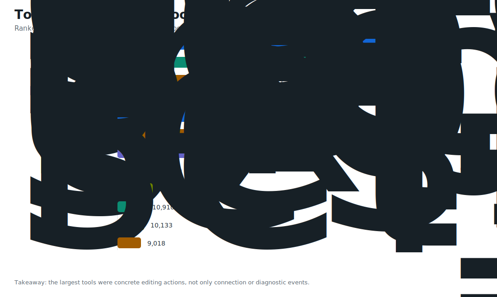
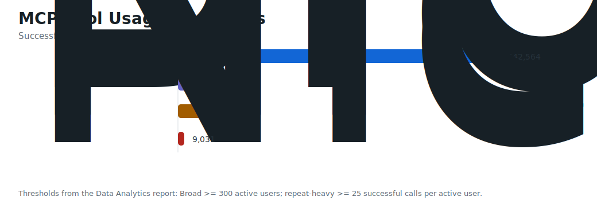

# MCP Magic 회고 Appendix: 데이터와 집계 기준

이 문서는 [MCP Magic 앱 회고](https://api.metadata.co.kr/blog/mcp-magic-retrospective) 본문에서 분리한 수치, 계산 기준, 프로젝트 연혁과 참고 자료다. Jekyll front matter를 넣지 않아 블로그 본문으로 렌더링하지 않으며, Markdown 원문으로 검토할 수 있다.

## 프로젝트 연혁

아래 날짜와 버전은 작성자의 프로젝트 기록을 기준으로 정리했다.

- 2025년 7월 18일: KMP 기반 TalkToFigma Desktop v1 공개
- 2025년 10월: MCP Magic이라는 이름의 패밀리 앱과 배포 페이지로 확장
- 2026년 1월 20일: 사용자 의견을 반영한 Electron 재작성 시작
- 2026년 1월 28일: KMP와 Gradle 코드를 제거한 Electron-only v2.0.0 공개
- 2026년 1월 29일: 전체 기능을 옮긴 v2.0.1 공개
- 이후: 언어 지원 확대, 로컬 LLM 기반 베타 실험

## GA4 집계

분석 기간은 2025년 7월 1일부터 2026년 6월 30일까지이며, 유효 데이터는 2025년 8월부터 확인됐다. 활성 사용자, 운영체제, 국가, 언어, MCP 호출과 도구별 성공·실패 데이터를 사용했다.

| 지표 | 값 | 참고 |
| --- | ---: | --- |
| 활성 사용자 | 31,360명 | 전체 기간 기준 |
| Windows 활성 사용자 | 21,090명 | OS별 사용자는 중복될 수 있음 |
| macOS 활성 사용자 | 10,444명 | OS별 사용자는 중복될 수 있음 |
| country 값 | 165개 | `(not set)` 포함, 정확한 국가 수가 아님 |
| language 값 | 37개 | GA4에 기록된 언어 값 기준 |
| MCP 도구 호출 | 570,373건 | 전체 호출 |
| 성공 호출 | 536,267건 | 성공 상태가 기록된 호출 |
| 실패 호출 | 33,777건 | 실패 상태가 기록된 호출 |
| 성공률 | 약 94.1% | 성공·실패 상태가 명시된 호출만 기준 |

성공·실패 상태별 보고서의 합계는 전체 호출보다 329건 적다. 성공률은 상태가 분류된 570,044건만을 분모로 계산했다.

언어별 활성 사용자는 영어 18,875명, 러시아어 4,094명, 한국어 2,766명, 프랑스어 1,209명, 중국어 990명 순이었다.

본문의 목적별 차트는 성공 호출 상위 32개 도구를 이름에 따라 6개 목적으로 분류한 결과다. 목적은 GA4에 직접 기록된 값이 아니라 분석자가 도구 이름을 바탕으로 나눈 것이다. 개별 도구 중에는 텍스트 레이어 생성 105,643건, 색상 적용 92,561건, 프레임 생성 52,509건이 성공했다.

## 세션 깊이와 첫 연결 지표

Aptabase 분석 기간은 2026년 2월 1일부터 2026년 7월 1일까지다. 중복 export를 제외해 익명 세션 단위로 집계했으며, 공개 아카이브에는 세션·사용자 식별자와 원본 이벤트 행을 포함하지 않았다.

| 지표 | 값 |
| --- | ---: |
| 전체 세션 | 9,852개 |
| MCP 호출이 포함된 세션 | 2,399개 |
| batch size를 반영한 추정 내부 MCP 호출 | 203,850건 |
| MCP 세션 평균 관측 span | 41분 11초 |
| MCP 세션 P95 관측 span | 2시간 13분 22초 |
| 세션당 추정 MCP 호출 중앙값 | 11건 |
| 세션당 추정 MCP 호출 P95 | 366건 |

세션 시간은 첫 이벤트와 마지막 이벤트 사이의 **관측 구간**이다. 사용자가 그 시간 내내 앱을 사용했다는 뜻은 아니다. batch size를 반영한 내부 호출 수도 추정값이다.

첫 연결 단계의 이벤트별 활성 사용자는 아래와 같다.

| 이벤트 | 활성 사용자 |
| --- | ---: |
| `app_start` | 30,912명 |
| `start_websocket_server` | 21,115명 |
| `mcp_tool_call` | 1,633명 |

이 값은 동일 기간에 각 이벤트를 한 번 이상 발생시킨 활성 사용자를 독립적으로 집계한 것이다. 동일 사용자의 순서를 추적한 퍼널이 아니므로 단계별 전환율이나 이탈률로 해석할 수 없다.

## 다운로드 집계

아래 수치는 스토어 집계와 GitHub의 선택된 설치 파일 다운로드를 합산한 값이다. 모든 배포 파일을 포함한 총다운로드가 아니며 고유 사용자 수도 아니다. 같은 사용자의 재다운로드나 여러 채널 사용이 중복될 수 있으므로 GA4 활성 사용자 수와 직접 비교하지 않는다.

| 플랫폼 | 계산 | 합계 |
| --- | --- | ---: |
| macOS | Mac App Store 전체 다운로드 11,047 + GitHub DMG 382 | 11,429건 |
| Windows | Microsoft Store 설치 8,976 + GitHub Setup EXE 385 | 9,361건 |
| 집계 대상 합계 | macOS 11,429 + Windows 9,361 | 20,790건 |

Mac App Store 수치는 앱 ID `6751596669`의 App Store Connect Analytics에서 확인했다. Lifetime 기간은 2025년 10월 21일부터 2026년 7월 10일까지이며, 전체 다운로드 11,047건에는 첫 다운로드 10,725건과 재다운로드 322건이 포함된다.

Microsoft Store 수치는 2025년 7월 7일부터 2026년 7월 6일까지의 주간 `Apps and Games Installs` export 두 개를 합산했다. 원본 CSV에는 앱이나 세그먼트 식별자가 없어, 두 파일이 Windows Store 집계의 두 부분이라는 소유자의 확인을 근거로 합산했다.

GitHub 수치는 글 작성 시점인 2026년 7월 12일에 저장한 `grab/TalkToFigmaDesktop` 공개 릴리즈 snapshot에서 DMG와 Setup EXE asset만 합산한 값이다. ZIP과 NUPKG 등 다른 배포 asset은 포함하지 않았다.

## 자료와 참고 링크

공개 가능한 집계, 분석 문서, 차트와 스토어 원본은 [연구 자료 아카이브](README.md)에 보관했다.

- [Grab 공식 소개 글: 팀을 위한 디자인 도구에서 오픈소스 프로젝트로](https://www.grab.com/inside-grab/stories/a-grab-engineer-built-this-design-tool-for-his-team-now-were-improving-it-for-everyone/)
- [Cursor Talk To Figma MCP 저장소](https://github.com/grab/cursor-talk-to-figma-mcp)
- [MCP Magic 프로젝트 페이지](https://api.metadata.co.kr/project/talk-to-figma-mcp)
- [Figma MCP 서버 개발자 문서](https://developers.figma.com/docs/figma-mcp-server/)
- [Figma Agent 소개](https://www.figma.com/blog/the-figma-agent-is-here/)
